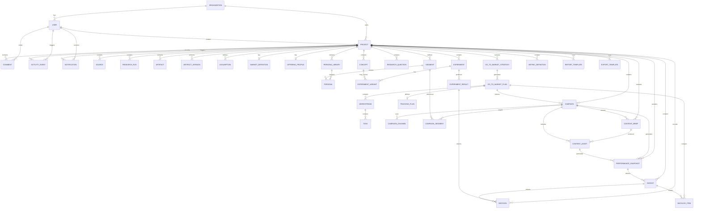

# PRD — Clarity
This file is an **auto-compiled PRD** generated by combining all Markdown documents under `docs/`.

## Sources

- `docs/product-brief.md`
- `docs/feature-hierarchy.md`
- `docs/domain-model.md`
- `docs/interaction-map.md`
- `docs/ui-flow.md`
- `docs/wireframe-map.md`
- `docs/reports.md`
- `docs/report-visualization.md`
- `docs/reporting-architecture.md`
- `docs/generation-prompt.md`

## Contents

- [product-brief](#product-brief)
- [feature-hierarchy](#feature-hierarchy)
- [domain-model](#domain-model)
- [interaction-map](#interaction-map)
- [ui-flow](#ui-flow)
- [wireframe-map](#wireframe-map)
- [reports](#reports)
- [report-visualization](#report-visualization)
- [reporting-architecture](#reporting-architecture)
- [generation-prompt](#generation-prompt)

---


## product-brief

_Source: `docs/product-brief.md`_

# Strategic Intelligence & Go-To-Market Platform

## Complete Product Description for UI/UX Design

## 1. Product Overview

The platform is a **Strategic Intelligence and Go-To-Market Operating System** that helps organizations move from **market insight to growth execution**.

Most companies currently use fragmented tools:

• Market research tools
• Survey platforms
• Strategy decks
• Marketing automation
• Content tools
• Analytics dashboards

This platform unifies those workflows into **one continuous strategic loop**:

**Market Research → Consumer Insight → Concept Testing → Go-To-Market Strategy → Go-To-Market Plan → Campaign Execution → Measurement → Insight → Optimization**

The experience should feel like a **strategic command center** rather than a collection of disconnected tools.

---

# 2. Core Product Philosophy

The platform should communicate three core ideas through the design:

### 1. Strategy and execution are connected

Insights directly produce action.

Example
A persona insight → influences messaging → influences campaign content.

---

### 2. AI assists but humans decide

AI generates:

• research summaries
• persona simulations
• strategy drafts
• content

But users always review and refine outputs.

---

### 3. Growth is a continuous loop

The interface should reinforce the loop:

Research → Strategy → Execution → Measurement → Learning.

This should be visually represented.

---

# 3. Primary Users

## Founder / Executive

Uses the platform to answer:

• Is this market worth entering?
• Who should we target?
• What strategy should we pursue?
• Is our marketing working?

Needs:
• strategic clarity
• executive dashboards
• reports

---

## Marketing Leader

Uses the platform to plan and run marketing.

Needs:

• campaigns
• content creation
• channel strategy
• performance tracking

---

## Product Manager

Uses the platform for:

• concept validation
• customer understanding
• product positioning

---

## Research Analyst

Uses the platform to:

• run research workflows
• generate insights
• build persona libraries

---

# 4. Core Mental Model

The product revolves around **Projects**.

A Project represents a strategic initiative.

Examples:

• entering a new market
• launching a new product
• improving marketing performance

Each Project contains the full workflow.

---

# 5. Primary System Modules

Designers should think of the system as **modules within a project workspace**.

### Modules

1. Dashboard
2. Research
3. Personas
4. Concepts
5. Go-To-Market Strategy
6. Go-To-Market Plan
7. Campaigns
8. Content
9. Measurement
10. Reports
11. Collaboration

Each module connects to others.

---

# 6. Core User Journey

## Step 1: Create a Project

User defines:

• business context
• product or offering
• market definition
• objective

Example:

“Launch an AI analytics platform for mid-market companies.”

---

## Step 2: Conduct Market Research

User gathers:

• market data
• trends
• competitors
• customer segments

Outputs include:

• market definition
• market size
• competitive landscape
• key insights

Design needs:

• structured research interface
• insight cards
• source references

---

## Step 3: Generate Personas

The system builds **synthetic personas** based on research.

Persona components:

• biography
• demographics
• motivations
• pain points
• buying triggers
• objections
• preferred channels

Personas can be viewed as:

• cards
• profiles
• segments

Design should make personas feel **human and understandable**.

---

## Step 4: Test Concepts

User can test:

• product concepts
• messaging
• marketing creative
• landing pages

Concept testing results include:

• preference ranking
• adoption likelihood
• willingness to pay
• objections

Design needs:

• comparison interfaces
• experiment dashboards

---

## Step 5: Create Go-To-Market Strategy

Strategy defines the high-level plan.

Elements:

Target segments
Positioning
Messaging architecture
Pricing
Channel strategy
Sales motion

Design should present strategy as **structured strategic artifacts**, not long documents.

Examples:

• strategy cards
• message frameworks
• positioning canvas

---

## Step 6: Generate Go-To-Market Plan

The strategy becomes an execution roadmap.

Components:

Workstreams
Tasks
Experiment backlog
Measurement plan

Workstreams include:

• content marketing
• paid media
• lifecycle marketing
• partnerships
• sales enablement

Design should support **task planning and prioritization**.

---

## Step 7: Execute Campaigns

Campaigns represent real marketing initiatives.

Campaign fields:

• objective
• audience
• channels
• messaging
• timeline
• budget

Campaign view should include:

• campaign overview
• content assets
• distribution schedule
• performance metrics

---

## Step 8: Generate Content

The platform includes an AI-assisted content engine.

Content types:

• blog posts
• social posts
• email sequences
• advertisements
• landing pages
• webinars
• sales materials

Content workflow:

Brief → Draft → Review → Approval → Publish

Design should support **editing, collaboration, and scheduling**.

---

## Step 9: Measure Performance

Performance metrics include:

• impressions
• engagement
• leads
• conversions
• revenue

Measurement views should include:

• campaign dashboards
• content performance
• funnel analytics

---

## Step 10: Generate Insights

The platform analyzes performance and generates insights.

Examples:

• high performing channels
• declining campaign performance
• emerging audience segments

Insights recommend actions.

Example:

“LinkedIn campaigns outperform search for Persona A.”

---

# 7. Information Architecture

Design navigation should feel **clean and strategic**.

Suggested navigation structure:

Dashboard
Projects
Research
Personas
Concepts
Strategy
Plans
Campaigns
Content
Measurement
Reports
Collaboration
Settings

---

# 8. Key Objects in the Interface

Design should support the following core objects.

### Project

Strategic workspace.

---

### Persona

Customer archetype.

---

### Concept

Idea or marketing asset being evaluated.

---

### Strategy

High-level Go-To-Market strategy.

---

### Plan

Operational execution roadmap.

---

### Campaign

Marketing initiative.

---

### Content Asset

Marketing content.

---

### Insight

AI-generated recommendation.

---

# 9. Key Screens to Design

Designers should create variations for these major screens.

### Project Dashboard

Displays:

• research progress
• strategy status
• active campaigns
• performance indicators

---

### Research Workspace

Displays:

• sources
• insights
• trends

---

### Persona Library

Displays persona cards and segments.

---

### Concept Testing Interface

Allows comparison between concepts.

---

### Strategy Builder

Structured interface to define:

• positioning
• messaging
• channels

---

### Plan Workspace

Task planning interface.

---

### Campaign Manager

Displays campaign details and assets.

---

### Content Studio

Editing and managing content.

---

### Analytics Dashboard

Performance metrics and insights.

---

# 10. Collaboration Features

Users should be able to:

• comment on strategy
• annotate research
• review content
• discuss insights

---

# 11. Design Goals

The interface should feel:

Strategic
Structured
Collaborative
Insight-driven
AI-assisted

Avoid:

• cluttered dashboards
• overly technical data visualizations
• document-heavy workflows

---

# 12. Desired Design Exploration

Designers should create **multiple UI directions**, for example:

### Direction 1

Strategy-first workspace.

---

### Direction 2

Research-driven workflow.

---

### Direction 3

Growth operations dashboard.

---

# 13. Overall Product Vision

The platform should feel like the **operating system for business strategy and growth**.

Users should be able to move seamlessly from:

understanding markets → designing strategy → executing campaigns → measuring growth.

The design should make complex strategy work **intuitive and visual**.

---


---


## feature-hierarchy

_Source: `docs/feature-hierarchy.md`_

Below is a **complete Platform Feature Hierarchy** for the Strategic Intelligence & Go-To-Market platform.
This is written as a **product architecture map** designers and product managers can use to ensure the system covers all required capabilities and avoids missing features.

The hierarchy is organized into **levels**:

**Level 1 — Product Pillars**
**Level 2 — Major Modules**
**Level 3 — Capabilities**
**Level 4 — Features**

This represents roughly **200–250 platform capabilities**.

---

# Strategic Intelligence & Go-To-Market Platform

# Complete Feature Hierarchy

---

# 1. Platform Foundation

## 1.1 User Management

### Identity

* User accounts
* User profiles
* Authentication
* Password management
* Session management

### Access Control

* Role-based permissions
* Project-level access
* Organization access
* Feature permissions

### Organization Management

* Organization profiles
* Team membership
* Invite users
* Remove users
* Role assignment

---

## 1.2 Workspace Management

### Projects

* Create project
* Duplicate project
* Archive project
* Delete project
* Project metadata
* Project owner assignment

### Project Configuration

* Industry selection
* Geography configuration
* Market category
* Business stage
* Strategic objective

---

## 1.3 Global Navigation

### Navigation System

* Sidebar navigation
* Project selector
* Global search
* Notifications
* User menu

### Global Workspace Tools

* Activity feed
* AI assistant
* Help center
* Feedback tools

---

# 2. Research Intelligence

## 2.1 Market Research

### Market Definition

* Define market scope
* Define geographic boundaries
* Define customer types
* Market segmentation

### Market Sizing

* Total Addressable Market
* Serviceable Available Market
* Serviceable Obtainable Market
* Growth estimates
* Historical trends

### Market Drivers

* Technology drivers
* Economic drivers
* Regulatory drivers
* Behavioral drivers

---

## 2.2 Competitive Intelligence

### Competitor Database

* Add competitors
* Edit competitor profiles
* Categorize competitors
* Tag competitors

### Competitor Analysis

* Product comparison
* Pricing comparison
* Positioning comparison
* Market share estimates

### Competitive Visualization

* Competitive matrix
* Market positioning map
* SWOT analysis
* Value curve charts

---

## 2.3 Source Management

### Data Sources

* Upload documents
* Add web sources
* Add notes
* Add research datasets

### Source Processing

* Document parsing
* Content indexing
* Source tagging
* Citation management

---

## 2.4 Research Insights

### Insight Generation

* AI research synthesis
* Insight extraction
* Trend detection

### Insight Management

* Insight library
* Insight tagging
* Insight editing
* Confidence scoring

---

# 3. Audience Intelligence

## 3.1 Segmentation

### Segment Definition

* Define segments
* Segment criteria
* Segment attributes

### Segment Analysis

* Segment size estimates
* Segment needs
* Segment behaviors
* Segment value potential

---

## 3.2 Persona Modeling

### Persona Library

* Generate personas
* Import personas
* Edit personas
* Archive personas

### Persona Profiles

* Biography
* Demographics
* Psychographics
* Goals
* Pain points
* Buying triggers

### Persona Simulation

* Simulated interviews
* Messaging response simulation
* Concept response simulation

---

## 3.3 Customer Journey Mapping

### Journey Stages

* Awareness
* Consideration
* Evaluation
* Purchase
* Retention

### Journey Insights

* Key touchpoints
* Friction points
* Decision triggers

---

# 4. Concept Validation

## 4.1 Concept Creation

### Concept Types

* Product concept
* Messaging concept
* Campaign concept
* Creative concept
* Landing page concept

### Concept Content

* Description
* Assets
* Features
* Value proposition

---

## 4.2 Concept Experiments

### Experiment Setup

* Define test objective
* Define test audience
* Define variants

### Testing Methods

* Persona simulation
* Survey testing
* Analytics testing

---

## 4.3 Experiment Results

### Result Metrics

* Preference score
* Adoption likelihood
* Purchase intent
* Feedback analysis

### Result Insights

* Winning concept
* Key objections
* Improvement recommendations

---

# 5. Go-To-Market Strategy

## 5.1 Target Market Strategy

### Segment Prioritization

* Segment scoring
* Segment ranking
* Segment opportunity assessment

---

## 5.2 Positioning

### Positioning Development

* Category definition
* Value proposition
* Differentiation

### Positioning Artifacts

* Positioning statement
* Value proposition canvas
* Differentiation matrix

---

## 5.3 Messaging Architecture

### Message Framework

* Core message
* Supporting pillars
* Proof points

### Messaging Variants

* Persona-specific messaging
* Channel-specific messaging

---

## 5.4 Pricing Strategy

### Pricing Models

* Subscription
* Usage-based
* Tiered pricing
* Enterprise pricing

### Pricing Experiments

* Price sensitivity tests
* Pricing comparisons

---

## 5.5 Channel Strategy

### Channel Identification

* Content marketing
* Social media
* Search
* Partnerships
* Events

### Channel Prioritization

* Channel scoring
* Channel mix planning

---

# 6. Go-To-Market Planning

## 6.1 Plan Generation

### Planning Framework

* Timeline
* Budget
* Strategic priorities

### Plan Outputs

* Execution roadmap
* Workstreams
* Task lists

---

## 6.2 Workstream Management

### Workstream Types

* Content marketing
* Paid media
* Lifecycle marketing
* Partnerships
* Sales enablement

### Workstream Planning

* Workstream owners
* Workstream objectives
* Workstream timelines

---

## 6.3 Task Management

### Task System

* Task creation
* Task assignment
* Task prioritization
* Task dependencies

### Task Tracking

* Task status
* Task deadlines
* Task progress

---

## 6.4 Experiment Backlog

### Experiment Ideas

* Hypothesis definition
* Experiment prioritization

### Experiment Tracking

* Experiment status
* Experiment results

---

# 7. Campaign Execution

## 7.1 Campaign Management

### Campaign Creation

* Campaign objective
* Campaign audience
* Campaign messaging

### Campaign Planning

* Budget allocation
* Channel allocation
* Timeline creation

---

## 7.2 Channel Execution

### Channel Management

* Social channels
* Email marketing
* Paid media
* Search marketing
* Partnerships

---

## 7.3 Campaign Timeline

### Scheduling

* Activity scheduling
* Publishing calendar

### Coordination

* Channel coordination
* Cross-channel alignment

---

# 8. Content System

## 8.1 Content Strategy

### Content Planning

* Content pillars
* Content themes
* Editorial calendar

---

## 8.2 Content Briefs

### Brief Creation

* Audience
* Objective
* Key message
* Proof points

---

## 8.3 Content Creation

### AI Content Generation

* Blog articles
* Social posts
* Email sequences
* Advertising copy
* Landing pages

### Editing Tools

* Content editing
* Version history
* Collaboration

---

## 8.4 Content Distribution

### Publishing

* Schedule posts
* Publish content

### Channel Distribution

* Social media
* Email campaigns
* Blog publishing

---

# 9. Measurement and Analytics

## 9.1 Performance Metrics

### Marketing Metrics

* Impressions
* Engagement
* Leads
* Conversions

### Revenue Metrics

* Revenue
* Customer acquisition cost
* Customer lifetime value

---

## 9.2 Campaign Analytics

### Campaign Insights

* Campaign performance
* Channel performance
* ROI analysis

---

## 9.3 Content Analytics

### Content Metrics

* Views
* Shares
* Engagement
* Conversion contribution

---

## 9.4 Funnel Analytics

### Funnel Stages

* Awareness
* Engagement
* Lead
* Conversion

### Funnel Insights

* Drop-off points
* Conversion rates

---

# 10. Insight Engine

## 10.1 Insight Generation

### Automated Analysis

* Performance anomalies
* Trend detection
* Opportunity identification

---

## 10.2 Recommendations

### Optimization Suggestions

* Campaign optimization
* Messaging changes
* Channel adjustments

---

# 11. Reporting

## 11.1 Report Generation

### Report Types

* Market research report
* Consumer insight report
* Concept testing report
* Go-To-Market strategy report
* Campaign performance report

---

## 11.2 Report Management

### Versioning

* Report versions
* Change history

### Export

* Export to PDF
* Export to document
* Export to presentation

---

# 12. Collaboration

## 12.1 Comments

### Comment Features

* Add comment
* Reply to comment
* Mention users

---

## 12.2 Activity Tracking

### Activity Feed

* Project updates
* Research updates
* Campaign activity

---

## 12.3 Notifications

### Notification Types

* Task assignments
* Mention alerts
* System alerts

---

# 13. Artificial Intelligence

## 13.1 Research AI

Capabilities

* Summarize research
* Extract insights
* Detect trends

---

## 13.2 Persona AI

Capabilities

* Generate personas
* Simulate consumer responses

---

## 13.3 Strategy AI

Capabilities

* Generate strategy drafts
* Suggest messaging
* Recommend channels

---

## 13.4 Content AI

Capabilities

* Generate content
* Rewrite content
* Personalize content

---

## 13.5 Analytics AI

Capabilities

* Analyze performance
* Detect anomalies
* Generate insights

---

# 14. Platform Vision

The platform should function as a **unified strategic intelligence and growth execution system**.

Users should be able to:

Understand markets
Understand customers
Validate ideas
Design strategy
Execute marketing
Measure growth
Continuously improve outcomes.


---


## domain-model

_Source: `docs/domain-model.md`_

# Strategic Intelligence and Go-To-Market Platform

## Platform Domain Model Diagram



---

# Domain model by layer

## 1. Workspace and system layer

These objects define the overall operating environment.

### Organization

The company or team account.

### User

A person using the platform.

### Project

The top-level strategic workspace.
A project represents an initiative such as:

* entering a new market
* launching a product
* improving marketing performance
* building a Go-To-Market motion

Everything important lives inside a project.

---

## 2. Research and provenance layer

This is the trust layer of the system.

### Source

Any input used in research:

* uploaded files
* web links
* notes
* datasets

### ResearchRun

A tracked AI or user-driven workflow execution, such as:

* market scan
* persona generation
* concept testing
* strategy generation
* plan generation
* content generation

### Artifact

A durable generated or curated output such as:

* report
* chart
* strategy document
* plan document
* export
* synthesis

### ArtifactVersion

Version history for artifacts.

### Assumption

A declared assumption used in analysis or planning.

### Decision

A strategic or tactical decision made in the project.

This layer is what makes the platform auditable and evidence-based.

---

## 3. Market and business layer

### MarketDefinition

The formal definition of the market being analyzed.

Includes:

* category
* geography
* customer type
* boundaries
* keywords

### OfferingProfile

The canonical representation of the product, service, or offer.

Includes:

* positioning
* pricing model
* features
* use cases
* benefits
* differentiators

This object should be reused across:

* concept testing
* Go-To-Market strategy
* content generation
* campaign planning

---

## 4. Audience intelligence layer

### Segment

The canonical target audience object.

A segment may represent:

* ideal customer profile
* buyer segment
* user segment
* account segment

### PersonaLibrary

A collection of personas for a project.

### Persona

A synthetic or manually defined persona tied to a segment.

Includes:

* goals
* pains
* objections
* triggers
* channel preferences
* behavioral patterns

### ResearchQuestion

Questions guiding research, testing, or analysis.

This layer powers:

* consumer research
* concept testing
* messaging
* targeting
* campaign planning

---

## 5. Concept and experimentation layer

### Concept

Any idea or asset being evaluated, such as:

* product idea
* offer
* landing page
* advertisement
* packaging
* message

### Experiment

A test process, such as:

* concept test
* pricing test
* message test
* creative test
* channel test

### ExperimentVariant

A specific version being tested.

### ExperimentResult

The output of the experiment.

This layer is the bridge between research and strategic choice.

---

## 6. Go-To-Market strategy layer

### GoToMarketStrategy

The high-level strategic framework.

Includes:

* target segments
* positioning
* messaging architecture
* pricing strategy
* channel strategy
* sales motion
* partnership strategy
* key metrics

This object should be relatively stable and should guide the rest of execution.

---

## 7. Go-To-Market planning layer

### GoToMarketPlan

The tactical execution model derived from strategy.

Includes:

* timeline
* budget
* workstreams
* priorities
* measurement plan

### Workstream

A major execution stream, such as:

* content marketing
* paid media
* lifecycle marketing
* partnerships
* sales enablement
* analytics

### Task

An actionable item within a workstream.

### BacklogItem

A prioritized idea for future execution, experiment, or optimization.

### TrackingPlan

The measurement design for the Go-To-Market plan.

This layer turns strategy into operations.

---

## 8. Campaign and content execution layer

### Campaign

A coordinated marketing initiative.

Includes:

* objective
* audience
* messaging
* budget
* timeline

### CampaignChannel

The channels used in a campaign.

### CampaignSegment

The target segments for a campaign.

### ContentBrief

The structured prompt/specification for a content asset.

### ContentAsset

A concrete output such as:

* blog post
* social post
* email
* landing page
* ad copy
* webinar
* sales asset

This layer is where the platform starts producing tangible market activity.

---

## 9. Measurement and optimization layer

### MetricDefinition

The canonical definition of a tracked metric.

### PerformanceSnapshot

A point-in-time performance record for:

* project
* campaign
* content asset

### Insight

An interpreted recommendation or pattern based on data.

Examples:

* “LinkedIn outperforms search for Segment A”
* “Message variant B converts better for mid-market buyers”
* “Webinars generate stronger downstream pipeline than blog traffic”

Insights should create:

* decisions
* experiments
* backlog items
* strategy refinements

---

## 10. Collaboration and enablement layer

### Comment

Feedback attached to project objects.

### ActivityEvent

System and user activity tracking.

### Notification

Alerts for users.

### ReportTemplate

A structure for generating reports.

### ExportTemplate

A structure for exports such as PDF or presentations.

---

# Relationship logic in plain English

Here is the system logic in human terms:

A **Project** contains all strategic work.
A Project collects **Sources** and runs **ResearchRuns**.
Research produces **Artifacts**, **Assumptions**, and **Decisions**.
A Project defines a **MarketDefinition** and an **OfferingProfile**.
That research informs **Segments** and a **PersonaLibrary**.
Those feed **Concepts** and **Experiments**.
Experiment results inform the **Go-To-Market Strategy**.
The strategy generates a **Go-To-Market Plan**.
The plan creates **Workstreams**, **Tasks**, **Backlog Items**, and a **Tracking Plan**.
The plan also drives **Campaigns**.
Campaigns produce **ContentBriefs** and **ContentAssets**.
Campaign and content performance are tracked in **PerformanceSnapshots**.
Performance generates **Insights**.
Insights feed new **Decisions**, **Experiments**, and **Backlog Items**.
That closes the optimization loop.

---

# Recommended visual grouping for design and product teams

If this is turned into a visual diagram, group the objects into these swimlanes:

### Lane 1 — Workspace

* Organization
* User
* Project

### Lane 2 — Research and Evidence

* Source
* ResearchRun
* Artifact
* ArtifactVersion
* Assumption
* Decision

### Lane 3 — Market and Audience

* MarketDefinition
* OfferingProfile
* Segment
* PersonaLibrary
* Persona
* ResearchQuestion

### Lane 4 — Validation

* Concept
* Experiment
* ExperimentVariant
* ExperimentResult

### Lane 5 — Strategy and Planning

* GoToMarketStrategy
* GoToMarketPlan
* Workstream
* Task
* BacklogItem
* TrackingPlan

### Lane 6 — Execution

* Campaign
* CampaignChannel
* CampaignSegment
* ContentBrief
* ContentAsset

### Lane 7 — Measurement and Optimization

* MetricDefinition
* PerformanceSnapshot
* Insight

### Lane 8 — Collaboration and Reporting

* Comment
* ActivityEvent
* Notification
* ReportTemplate
* ExportTemplate

---

# Most important modeling rule

This platform should always follow this rule:

**Durable business concepts get canonical entities.
Generated outputs get artifacts.
Workflow state lives in runs.**

That one rule will keep the product from becoming polluted again.


---


## interaction-map

_Source: `docs/interaction-map.md`_

Below is a **complete UX Interaction Map** for the platform.
This goes beyond the screen list and defines:

• how users move between screens
• primary navigation flows
• object interaction flows
• lifecycle transitions
• contextual actions
• cross-module connections

A design team can directly translate this into **Figma prototypes, user flows, and clickable journeys**.

---

# Strategic Intelligence & Go-To-Market Platform

# UX Interaction Map

---

# 1. Global Navigation Behavior

The platform uses a **persistent navigation layout**.

### Layout

Top Navigation Bar

* Project Selector
* Global Search
* Notifications
* User Menu

Left Sidebar Navigation

* Dashboard
* Projects
* Research
* Personas
* Concepts
* Go-To-Market Strategy
* Go-To-Market Plan
* Campaigns
* Content
* Measurement
* Reports
* Collaboration
* Settings

Right Context Panel

* AI Assistant
* Comments
* Activity
* Insights

---

# 2. Project Creation Flow

### Entry Point

Projects → Create Project

---

### Screen Flow

Projects List
→ Create Project Form
→ Project Overview
→ Research Workspace

---

### User Actions

User defines:

* project name
* industry
* geography
* business stage
* objective

System initializes modules:

* research workspace
* persona library
* strategy template
* execution plan framework

---

# 3. Research Flow

### Entry

Project Overview → Research

---

### Screen Flow

Research Workspace
→ Add Sources
→ Generate Insights
→ Define Market
→ Define Segments

---

### User Journey

User adds sources

Sources can be

* documents
* URLs
* notes

AI analyzes sources and produces insights.

User reviews insights.

Insights feed:

* market definition
* segments
* personas

---

# 4. Persona Creation Flow

### Entry

Research Workspace → Personas

---

### Screen Flow

Persona Library
→ Generate Personas
→ Persona Detail
→ Persona Simulation

---

### Interaction

User selects:

* target segments
* generation method

System generates personas.

User reviews persona cards.

Click persona → open persona detail.

Persona detail includes:

* biography
* motivations
* objections
* preferred channels
* purchasing triggers

---

# 5. Concept Testing Flow

### Entry

Concepts Module

---

### Screen Flow

Concept Library
→ Create Concept
→ Concept Detail
→ Concept Test Setup
→ Concept Results

---

### User Journey

User creates concept.

Concept may include:

* product idea
* marketing creative
* landing page

User launches test.

System runs:

* persona simulations
* surveys

Results show:

* concept preference
* adoption likelihood
* objections

Concept results influence strategy.

---

# 6. Go-To-Market Strategy Flow

### Entry

Project → Go-To-Market Strategy

---

### Screen Flow

Strategy Overview
→ Segment Targeting
→ Positioning Builder
→ Messaging Architecture
→ Channel Strategy
→ Strategy Summary

---

### Interaction

User selects segments.

System recommends strategy.

User edits strategy components.

Strategy artifacts include:

* positioning statement
* messaging framework
* channel priorities

Strategy is finalized and saved.

---

# 7. Go-To-Market Plan Flow

### Entry

Go-To-Market Strategy → Generate Plan

---

### Screen Flow

Plan Overview
→ Workstream Board
→ Task Board
→ Experiment Backlog
→ Measurement Plan

---

### Workstream Interaction

User views workstreams.

Example workstreams:

* Content marketing
* Paid media
* Lifecycle marketing
* Partnerships

Each workstream contains tasks.

Tasks include:

* owner
* due date
* dependencies
* status

---

# 8. Campaign Creation Flow

### Entry

Go-To-Market Plan → Campaigns

---

### Screen Flow

Campaign Library
→ Create Campaign
→ Campaign Overview
→ Campaign Timeline
→ Channel Planning

---

### User Journey

User defines campaign.

Fields include:

* objective
* audience
* channels
* messaging
* timeline

Campaign appears in execution dashboard.

---

# 9. Content Production Flow

### Entry

Campaign → Content

---

### Screen Flow

Content Studio
→ Create Content Brief
→ AI Generate Content
→ Edit Content
→ Approve Content
→ Schedule Content

---

### Content Workflow

Brief → Draft → Review → Approval → Publish

---

### Interaction

User edits AI generated content.

Content can be scheduled in calendar.

Published content feeds measurement.

---

# 10. Measurement Flow

### Entry

Campaign or Navigation → Measurement

---

### Screen Flow

Performance Dashboard
→ Campaign Performance
→ Content Performance
→ Funnel Analytics

---

### Dashboard Interaction

User selects:

* campaign
* channel
* content

System displays:

* impressions
* engagement
* leads
* conversions

---

# 11. Insight Generation Flow

### Entry

Measurement → Insights

---

### Screen Flow

Insight Feed
→ Insight Detail

---

### Insight Interaction

Insights show:

* detected trend
* explanation
* recommended action

Example:

"Email campaigns outperform social media for Persona A."

User can:

* create experiment
* adjust campaign
* update strategy

---

# 12. Reports Flow

### Entry

Navigation → Reports

---

### Screen Flow

Reports Library
→ Report Viewer
→ Export Options

---

### Report Types

Market Research
Consumer Insights
Concept Testing
Go-To-Market Strategy
Campaign Performance

---

# 13. Collaboration Flow

### Entry

Any screen

---

### Interaction

Users can:

* comment on research
* comment on strategy
* comment on content
* mention users

Comments appear in context panel.

---

# 14. AI Assistant Flow

AI assistant available on every screen.

Capabilities

* summarize research
* generate strategy
* suggest campaign ideas
* generate content
* analyze performance

User can ask questions like:

"What segments should we target?"

AI references project data.

---

# 15. Optimization Loop

Continuous loop:

Research
→ Personas
→ Concepts
→ Strategy
→ Plan
→ Campaigns
→ Content
→ Measurement
→ Insights
→ Experiments

Interface should visually reinforce this loop.

---

# 16. Key Cross-Module Interactions

Persona → Messaging
Messaging → Campaign
Campaign → Content
Content → Measurement
Measurement → Insights
Insights → Experiments

These relationships must be visible in the interface.

---

# 17. Designer Deliverables

Designers should produce:

User flow diagrams
Low fidelity wireframes
High fidelity UI designs
Clickable prototypes

Design exploration should include multiple approaches:

Strategy-first interface
Research-first interface
Growth operations interface

---

# 18. Overall Experience Goal

The platform should feel like:

A strategic command center
A growth operating system
A collaborative workspace

Users should move effortlessly from:

understanding markets
to designing strategy
to executing campaigns
to optimizing growth.

---


---


## ui-flow

_Source: `docs/ui-flow.md`_

Below is a **complete UX Interaction Map** for the platform.
This goes beyond the screen list and defines:

• how users move between screens
• primary navigation flows
• object interaction flows
• lifecycle transitions
• contextual actions
• cross-module connections

A design team can directly translate this into **Figma prototypes, user flows, and clickable journeys**.

---

# Strategic Intelligence & Go-To-Market Platform

# UX Interaction Map

---

# 1. Global Navigation Behavior

The platform uses a **persistent navigation layout**.

### Layout

Top Navigation Bar

* Project Selector
* Global Search
* Notifications
* User Menu

Left Sidebar Navigation

* Dashboard
* Projects
* Research
* Personas
* Concepts
* Go-To-Market Strategy
* Go-To-Market Plan
* Campaigns
* Content
* Measurement
* Reports
* Collaboration
* Settings

Right Context Panel

* AI Assistant
* Comments
* Activity
* Insights

---

# 2. Project Creation Flow

### Entry Point

Projects → Create Project

---

### Screen Flow

Projects List
→ Create Project Form
→ Project Overview
→ Research Workspace

---

### User Actions

User defines:

* project name
* industry
* geography
* business stage
* objective

System initializes modules:

* research workspace
* persona library
* strategy template
* execution plan framework

---

# 3. Research Flow

### Entry

Project Overview → Research

---

### Screen Flow

Research Workspace
→ Add Sources
→ Generate Insights
→ Define Market
→ Define Segments

---

### User Journey

User adds sources

Sources can be

* documents
* URLs
* notes

AI analyzes sources and produces insights.

User reviews insights.

Insights feed:

* market definition
* segments
* personas

---

# 4. Persona Creation Flow

### Entry

Research Workspace → Personas

---

### Screen Flow

Persona Library
→ Generate Personas
→ Persona Detail
→ Persona Simulation

---

### Interaction

User selects:

* target segments
* generation method

System generates personas.

User reviews persona cards.

Click persona → open persona detail.

Persona detail includes:

* biography
* motivations
* objections
* preferred channels
* purchasing triggers

---

# 5. Concept Testing Flow

### Entry

Concepts Module

---

### Screen Flow

Concept Library
→ Create Concept
→ Concept Detail
→ Concept Test Setup
→ Concept Results

---

### User Journey

User creates concept.

Concept may include:

* product idea
* marketing creative
* landing page

User launches test.

System runs:

* persona simulations
* surveys

Results show:

* concept preference
* adoption likelihood
* objections

Concept results influence strategy.

---

# 6. Go-To-Market Strategy Flow

### Entry

Project → Go-To-Market Strategy

---

### Screen Flow

Strategy Overview
→ Segment Targeting
→ Positioning Builder
→ Messaging Architecture
→ Channel Strategy
→ Strategy Summary

---

### Interaction

User selects segments.

System recommends strategy.

User edits strategy components.

Strategy artifacts include:

* positioning statement
* messaging framework
* channel priorities

Strategy is finalized and saved.

---

# 7. Go-To-Market Plan Flow

### Entry

Go-To-Market Strategy → Generate Plan

---

### Screen Flow

Plan Overview
→ Workstream Board
→ Task Board
→ Experiment Backlog
→ Measurement Plan

---

### Workstream Interaction

User views workstreams.

Example workstreams:

* Content marketing
* Paid media
* Lifecycle marketing
* Partnerships

Each workstream contains tasks.

Tasks include:

* owner
* due date
* dependencies
* status

---

# 8. Campaign Creation Flow

### Entry

Go-To-Market Plan → Campaigns

---

### Screen Flow

Campaign Library
→ Create Campaign
→ Campaign Overview
→ Campaign Timeline
→ Channel Planning

---

### User Journey

User defines campaign.

Fields include:

* objective
* audience
* channels
* messaging
* timeline

Campaign appears in execution dashboard.

---

# 9. Content Production Flow

### Entry

Campaign → Content

---

### Screen Flow

Content Studio
→ Create Content Brief
→ AI Generate Content
→ Edit Content
→ Approve Content
→ Schedule Content

---

### Content Workflow

Brief → Draft → Review → Approval → Publish

---

### Interaction

User edits AI generated content.

Content can be scheduled in calendar.

Published content feeds measurement.

---

# 10. Measurement Flow

### Entry

Campaign or Navigation → Measurement

---

### Screen Flow

Performance Dashboard
→ Campaign Performance
→ Content Performance
→ Funnel Analytics

---

### Dashboard Interaction

User selects:

* campaign
* channel
* content

System displays:

* impressions
* engagement
* leads
* conversions

---

# 11. Insight Generation Flow

### Entry

Measurement → Insights

---

### Screen Flow

Insight Feed
→ Insight Detail

---

### Insight Interaction

Insights show:

* detected trend
* explanation
* recommended action

Example:

"Email campaigns outperform social media for Persona A."

User can:

* create experiment
* adjust campaign
* update strategy

---

# 12. Reports Flow

### Entry

Navigation → Reports

---

### Screen Flow

Reports Library
→ Report Viewer
→ Export Options

---

### Report Types

Market Research
Consumer Insights
Concept Testing
Go-To-Market Strategy
Campaign Performance

---

# 13. Collaboration Flow

### Entry

Any screen

---

### Interaction

Users can:

* comment on research
* comment on strategy
* comment on content
* mention users

Comments appear in context panel.

---

# 14. AI Assistant Flow

AI assistant available on every screen.

Capabilities

* summarize research
* generate strategy
* suggest campaign ideas
* generate content
* analyze performance

User can ask questions like:

"What segments should we target?"

AI references project data.

---

# 15. Optimization Loop

Continuous loop:

Research
→ Personas
→ Concepts
→ Strategy
→ Plan
→ Campaigns
→ Content
→ Measurement
→ Insights
→ Experiments

Interface should visually reinforce this loop.

---

# 16. Key Cross-Module Interactions

Persona → Messaging
Messaging → Campaign
Campaign → Content
Content → Measurement
Measurement → Insights
Insights → Experiments

These relationships must be visible in the interface.

---

# 17. Designer Deliverables

Designers should produce:

User flow diagrams
Low fidelity wireframes
High fidelity UI designs
Clickable prototypes

Design exploration should include multiple approaches:

Strategy-first interface
Research-first interface
Growth operations interface

---

# 18. Overall Experience Goal

The platform should feel like:

A strategic command center
A growth operating system
A collaborative workspace

Users should move effortlessly from:

understanding markets
to designing strategy
to executing campaigns
to optimizing growth.


---


## wireframe-map

_Source: `docs/wireframe-map.md`_

Wirefram Map

---

# Strategic Intelligence & Go-To-Market Platform

# Complete UX Wireframe Map

---

# 1. Global Application Layout

All screens follow a consistent application structure.

## Layout Structure

**Top Bar**

Contains:

* Project selector
* Global search
* Notifications
* User menu

**Left Navigation**

Primary modules:

Dashboard
Projects
Research
Personas
Concepts
Go-To-Market Strategy
Go-To-Market Plan
Campaigns
Content
Measurement
Reports
Collaboration
Settings

**Main Workspace**

Dynamic workspace for module content.

**Right Panel (Context Panel)**

Used for:

* insights
* activity
* comments
* AI assistant

---

# 2. Project Lifecycle Flow

Every project follows this lifecycle:

1. Project Setup
2. Research
3. Personas
4. Concept Testing
5. Go-To-Market Strategy
6. Go-To-Market Plan
7. Campaign Execution
8. Measurement
9. Optimization

The interface should reinforce this flow.

---

# 3. Screen Map

---

# DASHBOARD

## Screen 1: Global Dashboard

Purpose
Executive overview of activity across projects.

Sections

Active Projects
Research Progress
Campaign Performance
Recent Insights
Notifications

Widgets

Project Health
Strategy Progress
Top Campaigns
Content Performance

---

## Screen 2: Project Dashboard

Purpose
Overview of a single project.

Sections

Project Summary
Research Status
Persona Library
Strategy Overview
Active Campaigns
Performance Snapshot

---

# PROJECTS

## Screen 3: Projects List

Displays all projects.

Elements

Project cards showing

Name
Industry
Status
Progress
Last activity

Actions

Create project
Open project
Archive project

---

## Screen 4: Create Project

Fields

Project name
Industry
Geography
Business stage
Strategic objective

---

## Screen 5: Project Overview

Displays

Project description
Research summary
Strategy summary
Execution status

---

# RESEARCH

## Screen 6: Research Workspace

Purpose
Central interface for market and consumer research.

Sections

Sources
Insights
Trends
Segments

---

## Screen 7: Add Research Sources

Options

Upload documents
Add URLs
Add manual notes

---

## Screen 8: Research Insight Board

Displays insights as cards.

Card fields

Title
Description
Supporting evidence
Confidence score

---

## Screen 9: Market Definition

Fields

Market description
Customer types
Geographies
Key trends

---

## Screen 10: Competitive Landscape

Displays competitors.

Visualization

Competitive positioning map

Fields

Competitor name
Positioning
Pricing
Strengths

---

# PERSONAS

## Screen 11: Persona Library

Displays all personas.

Persona card

Name
Segment
Key motivations
Pain points

---

## Screen 12: Persona Detail Page

Sections

Biography
Motivations
Pain points
Decision triggers
Channel preferences

---

## Screen 13: Persona Segment View

Displays persona distribution across segments.

Visualization

Segment map

---

## Screen 14: Persona Simulation

Allows simulated responses.

Use cases

Message testing
Concept testing

---

# CONCEPT TESTING

## Screen 15: Concepts Library

Displays all concepts.

Concept card

Name
Type
Status

---

## Screen 16: Create Concept

Fields

Name
Description
Concept type

---

## Screen 17: Concept Detail

Displays concept content.

Sections

Description
Assets
Features

---

## Screen 18: Concept Test Setup

User defines experiment.

Fields

Test objective
Concept variants
Target personas

---

## Screen 19: Concept Results

Displays test results.

Metrics

Preference score
Adoption likelihood
Feedback

---

# GO-TO-MARKET STRATEGY

## Screen 20: Strategy Overview

Displays strategy components.

Sections

Target segments
Positioning
Messaging
Pricing
Channels

---

## Screen 21: Segment Targeting

Allows selection of segments.

Displays

Segment profiles
Priority score

---

## Screen 22: Positioning Builder

Fields

Category
Primary value proposition
Differentiation

---

## Screen 23: Messaging Architecture

Structure

Core message
Supporting pillars
Proof points

---

## Screen 24: Channel Strategy

Displays channels.

Examples

Content marketing
Social media
Search
Partnerships

---

## Screen 25: Strategy Summary

Final strategy artifact.

Allows export.

---

# GO-TO-MARKET PLAN

## Screen 26: Plan Overview

Displays roadmap.

Sections

Timeline
Workstreams
Budget

---

## Screen 27: Workstream Board

Displays workstreams.

Examples

Content
Paid media
Lifecycle marketing

---

## Screen 28: Task Board

Kanban-style task planning.

Columns

To Do
In Progress
Completed

---

## Screen 29: Experiment Backlog

Displays potential experiments.

Fields

Hypothesis
Impact score
Priority

---

## Screen 30: Measurement Plan

Defines metrics.

Examples

Leads
Conversions
Revenue

---

# CAMPAIGNS

## Screen 31: Campaign Library

Displays campaigns.

Campaign card

Name
Status
Budget

---

## Screen 32: Campaign Overview

Displays campaign details.

Sections

Audience
Messaging
Channels

---

## Screen 33: Campaign Timeline

Calendar of campaign activities.

---

## Screen 34: Channel Planning

Displays channel allocation.

Visualization

Channel mix chart.

---

# CONTENT

## Screen 35: Content Studio

Displays content assets.

Content types

Blogs
Social posts
Emails

---

## Screen 36: Content Brief Builder

Fields

Audience
Objective
Key message

---

## Screen 37: Content Editor

Editing interface.

Supports

AI generation
Human editing
Version history

---

## Screen 38: Content Calendar

Displays publishing schedule.

---

# MEASUREMENT

## Screen 39: Performance Dashboard

Displays key metrics.

Widgets

Traffic
Leads
Conversions

---

## Screen 40: Campaign Performance

Displays performance by campaign.

---

## Screen 41: Content Performance

Displays performance by content asset.

---

## Screen 42: Funnel Analytics

Shows conversion funnel.

Stages

Awareness
Consideration
Conversion

---

# INSIGHTS

## Screen 43: Insight Feed

AI-generated insights.

Examples

Top performing content
Emerging customer segments

---

## Screen 44: Insight Detail

Displays analysis and recommendations.

---

# REPORTS

## Screen 45: Reports Library

Displays generated reports.

---

## Screen 46: Report Viewer

Displays full report.

Supports

Export
Comments

---

# COLLABORATION

## Screen 47: Comments Panel

Allows commenting on artifacts.

---

## Screen 48: Activity Feed

Shows project activity.

---

# SETTINGS

## Screen 49: User Settings

Profile and notifications.

---

## Screen 50: Organization Settings

User management and permissions.

---

# Primary UX Design Goals

The design should feel:

Strategic
Structured
Collaborative
Insight-driven
AI-assisted

Avoid:

Excessively technical interfaces
Overwhelming dashboards
Complex navigation

---

# Design Exploration Suggestions

Designers should produce multiple directions:

Strategy workspace
Research workspace
Growth operations dashboard

Each approach should emphasize the platform's core idea:

**Turning insight into growth execution.**


---


## reports

_Source: `docs/reports.md`_

Below is a **report-by-report blueprint** for the full platform reporting system. It specifies, for each report:

* purpose
* audience
* default structure
* exact sections
* recommended visualizations
* key tables and columns
* drill-down interactions
* citations, footnotes, assumptions, and references treatment
* export/readout considerations

This should give design, product, and engineering a concrete reporting standard.

---

# Strategic Intelligence and Go-To-Market Platform

## Report-by-Report Blueprint

---

# 1. Market Research Report

## Purpose

Evaluate market attractiveness, size, dynamics, competition, and risks.

## Primary audience

* founders
* executives
* strategy leads
* investors
* research analysts

## Report modes

* Executive summary view
* Full analyst view
* Exportable board-ready view

## Default report structure

### 1. Cover and metadata

Display:

* report title
* project name
* market name
* geography
* time horizon
* generated date
* version
* author / generated by
* confidence label

### 2. Executive summary

Include:

* overall market attractiveness verdict
* one-paragraph summary
* 5 key findings
* 3 major risks
* recommendation / implication

Visuals:

* market opportunity scorecard
* Total Addressable Market / Serviceable Available Market / Serviceable Obtainable Market summary card
* growth trend sparkline
* top risks mini heatmap

Drill-down:

* click any finding to jump to the supporting section
* click verdict to open rationale panel

### 3. Market definition and scope

Include:

* market description
* what is included
* what is excluded
* customer types
* regional scope

Visuals:

* ecosystem / market boundary diagram
* scope summary cards

Tables:

* scope definition table

Columns:

* dimension
* included
* excluded
* rationale
* citation

Drill-down:

* clicking ecosystem actor opens related competitor or segment detail

### 4. Market size and growth

Include:

* Total Addressable Market
* Serviceable Available Market
* Serviceable Obtainable Market
* methodology summary
* 3 to 5 year trend
* forecast range

Visuals:

* market size pyramid
* waterfall from total universe to obtainable share
* historical and projected growth line chart
* regional split bar chart if relevant

Tables:

* market sizing table

Columns:

* market layer
* estimate
* unit
* method
* assumptions
* confidence
* source refs

Drill-down:

* click any number to open calculation drawer
* calculation drawer shows formula, assumptions, sources, and segment/geography split

### 5. Market drivers

Include:

* technology drivers
* regulatory drivers
* behavioral drivers
* economic drivers

Visuals:

* driver impact matrix
* timeline of major market events
* driver-to-segment relationship map

Tables:

* driver analysis table

Columns:

* driver
* type
* direction of impact
* expected magnitude
* time horizon
* affected segments
* evidence strength

Drill-down:

* click driver to open evidence, related sources, and implications

### 6. Competitive landscape

Include:

* key competitors
* market structure
* positioning
* pricing
* strengths and weaknesses

Visuals:

* competitive positioning map
* competitor comparison matrix
* market share chart if available
* value curve / differentiation chart

Tables:

* competitor table

Columns:

* competitor
* category
* target audience
* pricing model
* key differentiator
* market position
* source count
* confidence

Drill-down:

* click competitor opens competitor detail page with profile, messaging, references, and related insights

### 7. Market risks and constraints

Include:

* structural risks
* regulatory risks
* technological risks
* macroeconomic risks

Visuals:

* risk heatmap
* risk timeline
* scenario sensitivity bars

Tables:

* risk register

Columns:

* risk
* type
* likelihood
* impact
* mitigation
* evidence / assumption

Drill-down:

* click risk opens mitigation plan and impacted metrics

### 8. Strategic implications

Include:

* what this market means for the business
* where to play
* where not to play
* strategic options

Visuals:

* opportunity matrix
* implication cards
* recommended focus areas

Tables:

* strategic options table

Columns:

* option
* upside
* risks
* required capabilities
* time to value

### 9. Methodology and references appendix

Include:

* source inventory
* modeling notes
* assumptions
* glossary

Visuals:

* evidence summary blocks

Tables:

* references table
* assumptions table

---

# 2. Consumer Research Report

## Purpose

Understand customer segments, personas, needs, pain points, decision behavior, and willingness to pay.

## Primary audience

* product managers
* marketers
* founders
* researchers

## Default report structure

### 1. Executive summary

Include:

* top segments
* most urgent needs
* strongest buying triggers
* key barriers
* recommendation for focus segment

Visuals:

* segment prioritization matrix
* top pain points summary bars
* willingness-to-pay snapshot

### 2. Segmentation overview

Include:

* segment definitions
* segment size estimates
* segment attractiveness
* segment differences

Visuals:

* segment distribution chart
* segment prioritization matrix
* segment profile cards

Tables:

* segment table

Columns:

* segment
* size estimate
* urgency
* value potential
* reachability
* complexity
* priority rank

Drill-down:

* click segment opens full segment profile and related personas

### 3. Persona profiles

Include:

* top personas by segment
* goals
* pain points
* objections
* trust drivers
* preferred channels
* buying role

Visuals:

* persona cards
* persona comparison table
* motivation / objection chips

Tables:

* persona comparison table

Columns:

* persona
* segment
* primary goal
* top pain
* objection
* trust driver
* preferred channel
* confidence
* simulated flag

Drill-down:

* click persona opens persona detail with evidence sources and simulation/calibration notes

### 4. Customer journey and decision process

Include:

* awareness
* evaluation
* comparison
* purchase
* onboarding
* retention

Visuals:

* customer journey map
* decision trigger timeline
* touchpoint map

Tables:

* journey stage table

Columns:

* stage
* user goal
* key questions
* blockers
* touchpoints
* content needed
* metrics

Drill-down:

* click stage opens recommended content, channel strategy, and related performance if available

### 5. Pain point and need analysis

Include:

* top pain points
* pain frequency
* pain severity
* unmet needs
* desired outcomes

Visuals:

* pain point priority chart
* need importance bars
* jobs-to-be-done map

Tables:

* pain point table

Columns:

* pain point
* frequency
* severity
* linked personas
* message opportunity
* source refs

### 6. Willingness to pay and buying behavior

Include:

* pricing sensitivity
* acceptable price range
* purchase criteria
* switching costs
* budget sensitivity

Visuals:

* willingness-to-pay curve
* purchase criteria ranking
* objection cluster map

Tables:

* pricing sensitivity table

Columns:

* segment/persona
* price floor
* price midpoint
* price ceiling
* sensitivity
* evidence type

### 7. Strategic implications

Include:

* recommended segment focus
* best messaging angles
* content needs
* pricing implications
* channel implications

### 8. Methodology and references appendix

Include:

* whether findings are source-backed, survey-based, simulated, or mixed
* persona calibration notes
* assumptions and references

---

# 3. Concept Testing Report

## Purpose

Evaluate product concepts, offers, creative, landing pages, or message variants.

## Primary audience

* product managers
* marketers
* founders
* strategy leads

## Default report structure

### 1. Executive summary

Include:

* winning concept / variant
* strongest and weakest dimensions
* adoption likelihood summary
* recommendation: proceed, refine, or reject

Visuals:

* concept score summary cards
* top concept ranking bar chart
* recommendation banner

### 2. Concepts tested

Include:

* concept descriptions
* variants
* test objective
* target audience
* methodology

Visuals:

* concept gallery cards
* side-by-side concept comparison

Tables:

* concept overview table

Columns:

* concept / variant
* description
* audience
* price point if relevant
* status

### 3. Preference and ranking

Include:

* overall concept preference
* ranking by segment
* ranking by persona if simulated

Visuals:

* preference ranking bars
* stacked preference shares
* segment comparison bars

Tables:

* preference results table

Columns:

* concept
* overall score
* segment score
* preference share
* rank
* confidence interval

Drill-down:

* click concept opens segment/persona response patterns

### 4. Adoption and purchase intent

Include:

* adoption likelihood
* perceived fit
* distinctiveness
* relevance

Visuals:

* adoption likelihood histogram
* score comparison bars
* segment split panels

Tables:

* adoption metrics table

Columns:

* concept
* adoption likelihood
* perceived value
* clarity
* distinctiveness
* median willingness to try

### 5. Feature and message drivers

Include:

* which features or claims drove response
* which elements caused confusion or resistance

Visuals:

* feature importance chart
* message resonance bars
* objection cluster map

Tables:

* driver analysis table

Columns:

* feature/message element
* positive contribution
* negative contribution
* linked concept(s)
* audience segments

### 6. Feedback and objections

Include:

* top objections
* confusion points
* requests for improvement
* positive themes

Visuals:

* objection clusters
* sentiment/theme cards
* quote panel if using real research
* synthesized response panel if simulated

### 7. Recommendation and next experiments

Include:

* recommended next move
* what to change
* what to validate next
* suggested test plan

### 8. Methodology and appendix

Include:

* test setup
* simulated vs real response distinction
* sample notes
* confidence intervals
* references and assumptions

---

# 4. Go-To-Market Strategy Report

## Purpose

Define the strategic choices for how the company will enter or expand in the market.

## Primary audience

* founders
* executives
* marketing leadership
* product marketing
* board / investors

## Default report structure

### 1. Executive summary

Include:

* strategic objective
* priority target segments
* positioning summary
* recommended channels
* pricing approach
* success criteria

Visuals:

* strategy scorecard
* segment opportunity matrix
* top-line channel summary

### 2. Strategic objective and context

Include:

* business objective
* offering overview
* timing rationale
* strategic constraints

Visuals:

* business context summary cards
* why-now timeline

### 3. Target segments

Include:

* segment prioritization
* recommended primary and secondary targets
* rationale

Visuals:

* segment opportunity matrix
* segment score table
* target pyramid or tiered focus diagram

Tables:

* target segment table

Columns:

* segment
* size
* urgency
* value potential
* acquisition difficulty
* strategic fit
* focus level

Drill-down:

* click segment opens segment detail, personas, and recommended message

### 4. Positioning

Include:

* category definition
* positioning statement
* alternative choices considered
* core differentiators

Visuals:

* positioning canvas
* competitive differentiation table
* before/after position map if relevant

Tables:

* differentiation table

Columns:

* claim
* supporting proof
* competitor contrast
* evidence strength

### 5. Messaging architecture

Include:

* core promise
* supporting pillars
* proof points
* persona-specific variants
* channel-specific variants

Visuals:

* messaging architecture tree
* message house
* proof point matrix

Tables:

* messaging table

Columns:

* message level
* message text
* target audience
* usage context
* proof required
* related source refs

### 6. Pricing and offer strategy

Include:

* pricing model
* package/tier structure
* pilot/entry offer
* objection handling

Visuals:

* pricing ladder
* package comparison cards
* willingness-to-pay comparison overlay

Tables:

* package table

Columns:

* package
* target segment
* price
* value metric
* included capabilities
* rationale

### 7. Channel strategy

Include:

* priority channels
* supporting channels
* rationale
* expected role of each channel
* sequencing

Visuals:

* channel prioritization matrix
* channel role map
* channel investment summary bars

Tables:

* channel strategy table

Columns:

* channel
* role
* segment fit
* expected impact
* expected cost
* time to signal
* confidence

### 8. Success metrics and strategic KPI tree

Include:

* top-level success metrics
* leading indicators
* lagging indicators
* thresholds

Visuals:

* KPI tree
* milestone scorecard

### 9. Risks and dependencies

Include:

* execution risks
* message risks
* channel dependency risks
* capability gaps

Visuals:

* risk heatmap
* dependency matrix

### 10. Strategic recommendation

Include:

* final recommendation
* must-believe assumptions
* immediate next steps

### 11. Appendix

Include:

* evidence, references, assumptions, and open questions

---

# 5. Go-To-Market Plan Report

## Purpose

Translate strategy into an actionable execution roadmap.

## Primary audience

* marketing leads
* growth teams
* product marketing
* operators
* founders

## Default report structure

### 1. Executive summary

Include:

* plan objective
* time horizon
* budget
* major workstreams
* key milestones
* top risks

Visuals:

* roadmap snapshot
* budget summary cards
* milestone strip

### 2. Plan overview

Include:

* plan time horizon
* assumptions
* resource model
* strategic priorities

Visuals:

* plan structure diagram
* workstream overview cards

### 3. Workstreams

Include:

* content marketing
* paid media
* lifecycle marketing
* partnerships
* sales enablement
* analytics / measurement
* optional product marketing

Visuals:

* workstream board
* workstream timeline
* workstream dependency map

Tables:

* workstream table

Columns:

* workstream
* objective
* owner
* start date
* end date
* status
* key milestones
* dependencies

Drill-down:

* click workstream opens task list, linked campaigns, linked content, and metric targets

### 4. Task plan

Include:

* critical tasks
* owners
* due dates
* dependencies
* status

Visuals:

* Kanban board
* Gantt timeline
* dependency lines if possible

Tables:

* task table

Columns:

* task
* workstream
* owner
* due date
* dependency
* priority
* status
* linked metric
* linked campaign

### 5. Experiment backlog

Include:

* major experiments
* hypotheses
* impact and effort
* sequencing

Visuals:

* impact-effort matrix
* experiment pipeline
* experiment calendar

Tables:

* experiment backlog table

Columns:

* experiment
* hypothesis
* owner
* target metric
* impact
* confidence
* effort
* priority
* planned timeframe

### 6. Measurement plan

Include:

* key metrics
* owners
* definitions
* targets
* cadence

Visuals:

* KPI tree
* metric ownership matrix
* reporting cadence map

Tables:

* metric definition table

Columns:

* metric
* formula
* owner
* source
* baseline
* target
* frequency

### 7. Budget and resourcing

Include:

* budget by workstream
* budget by channel
* staffing assumptions
* required capabilities

Visuals:

* budget allocation bars
* planned vs allocated waterfall
* resource availability chart

### 8. Risks and contingencies

Include:

* blocked dependencies
* resource constraints
* capability risks
* fallback options

### 9. 30/60/90-day view

Include:

* what happens in each phase
* milestone logic
* expected outputs

Visuals:

* phased timeline
* milestone table

### 10. Appendix

Include:

* assumptions
* task definitions
* references to strategy objects and experiments

---

# 6. Campaign Performance Report

## Purpose

Evaluate campaign effectiveness and identify optimizations.

## Primary audience

* marketing leaders
* growth teams
* founders
* campaign managers

## Default report structure

### 1. Executive summary

Include:

* campaign objective
* current status
* headline performance
* recommendation: scale, optimize, pause, or stop

Visuals:

* KPI summary cards
* target vs actual indicator
* campaign health signal

### 2. Campaign overview

Include:

* objective
* target segment
* channels used
* timeline
* budget

Visuals:

* campaign summary card
* channel mix summary
* timeline strip

### 3. Channel performance

Include:

* reach
* spend
* clicks
* leads
* conversions
* cost metrics
* quality metrics if available

Visuals:

* grouped channel comparison bars
* cost per result chart
* trend line by channel

Tables:

* channel performance table

Columns:

* channel
* spend
* impressions
* clicks
* click-through rate
* leads
* conversions
* cost per lead
* conversion rate
* return

Drill-down:

* click channel opens channel detail and linked content assets

### 4. Funnel performance

Include:

* impressions to conversion pipeline
* stage drop-offs
* segment/channel splits

Visuals:

* campaign funnel
* stage conversion table
* drop-off highlight cards

Tables:

* funnel stage table

Columns:

* stage
* volume
* conversion rate
* previous period
* change
* benchmark

### 5. Content and creative performance

Include:

* best and worst assets
* best messaging angles
* engagement vs conversion patterns

Visuals:

* content leaderboard
* creative comparison bars
* asset trend sparklines

Tables:

* asset performance table

Columns:

* asset
* channel
* impressions/views
* engagement
* clicks
* conversions
* cost if applicable
* influenced pipeline

### 6. Segment and persona performance

Include:

* which segments responded best
* persona resonance
* channel-segment alignment

Visuals:

* segment performance bars
* heatmap of channel by segment

### 7. Budget efficiency

Include:

* spend allocation
* planned vs actual
* return by channel
* diminishing returns where visible

Visuals:

* budget waterfall
* spend share chart
* efficiency scatterplot

### 8. Insights and recommendations

Include:

* what worked
* what underperformed
* what to change next
* what to test

### 9. Appendix

Include:

* definitions
* attribution method
* references and assumptions

---

# 7. Content Performance Report

## Purpose

Understand how content performs across awareness, engagement, conversion, and influence.

## Primary audience

* content marketers
* product marketing
* brand teams
* marketing leadership

## Default report structure

### 1. Executive summary

Include:

* best-performing content
* strongest content themes
* conversion contribution
* underperforming formats
* recommendation

Visuals:

* top assets leaderboard
* topic performance snapshot
* content funnel summary

### 2. Content overview

Include:

* number of assets
* distribution by type
* distribution by stage
* publishing cadence

Visuals:

* content type distribution
* publishing trend line
* content stage mix chart

### 3. Asset performance

Include:

* views
* engagement
* click-through
* conversions
* influenced pipeline / revenue if available

Visuals:

* asset leaderboard
* mini trend lines
* performance quartile view

Tables:

* content asset table

Columns:

* asset title
* type
* topic
* funnel stage
* campaign
* publish date
* views
* engagement
* conversions
* influenced revenue/pipeline

Drill-down:

* click asset opens content detail page with full performance and citations to claims if appropriate

### 4. Topic and pillar performance

Include:

* which themes perform best
* which topics create reach vs which create conversions

Visuals:

* topic performance bars
* awareness vs conversion scatterplot
* content pillar heatmap

### 5. Channel distribution and performance

Include:

* how content performs by channel
* where each type works best

Visuals:

* channel stacked bars
* channel-to-content matrix
* traffic source share chart

### 6. Content journey contribution

Include:

* which content works at which funnel stage
* assist role of content

Visuals:

* funnel-stage content contribution view
* simplified path analysis

### 7. Production operations

Include:

* production throughput
* time in stage
* approval bottlenecks
* missed schedules

Visuals:

* pipeline board snapshot
* average time-to-publish bars
* workflow bottleneck chart

### 8. Recommendations

Include:

* double down topics
* retire formats
* repurpose winners
* fix bottlenecks

### 9. Appendix

Include:

* metric definitions
* attribution notes
* references if content uses cited evidence

---

# 8. Performance Insights Report

## Purpose

Summarize the most important cross-functional patterns and recommended actions.

## Primary audience

* executives
* heads of marketing
* growth teams
* founders

## Default report structure

### 1. Executive summary

Include:

* top 5 insights
* top 5 risks
* top 5 actions
* notable metric shifts

Visuals:

* insight cards
* anomaly summary strip
* action queue

### 2. What changed

Include:

* significant changes in traffic, leads, conversion, CAC, revenue, retention, or content performance

Visuals:

* anomaly trend chart
* period-over-period scorecards
* variance waterfalls

Tables:

* metric change table

Columns:

* metric
* prior period
* current period
* delta
* probable cause
* confidence

### 3. Why it changed

Include:

* likely drivers
* channel changes
* content changes
* segment shifts
* offer changes

Visuals:

* driver decomposition chart
* channel/segment heatmap
* supporting breakdown tables

### 4. What to do next

Include:

* recommendations
* experiments
* owners
* urgency
* expected impact

Visuals:

* recommendation queue
* impact-effort matrix
* next-step roadmap

Tables:

* recommendation table

Columns:

* recommendation
* related metric
* expected impact
* effort
* confidence
* owner
* timeframe

### 5. Supporting evidence

Include:

* linked campaigns
* linked content
* linked research
* linked experiments

Visuals:

* evidence graph or linked object cards

### 6. Appendix

Include:

* methodology
* model assumptions
* references and citations

---

# 9. Executive Quarterly Business Review Report

## Purpose

Provide an executive and board-level narrative of strategic progress, performance, risks, and next-quarter priorities.

## Primary audience

* executives
* board members
* investors
* senior leadership

## Default report structure

### 1. Executive narrative

Include:

* what happened this quarter
* what mattered most
* overall business narrative
* key wins and misses

Visuals:

* quarterly scorecard
* business summary strip
* top insights panel

### 2. Strategic progress

Include:

* progress against strategic goals
* progress against Go-To-Market strategy
* new learnings

Visuals:

* strategic initiative tracker
* milestone completion chart
* KPI tree status

### 3. Market and customer learnings

Include:

* important changes in market
* new segment insights
* concept validation updates
* customer behavior shifts

Visuals:

* summary insight cards
* segment matrix
* pain point shifts if relevant

### 4. Go-To-Market execution performance

Include:

* campaign outcomes
* content outcomes
* channel outcomes
* sales enablement outcomes if tracked

Visuals:

* campaign performance summary
* channel comparison
* funnel performance

### 5. Financial and efficiency signals

Include:

* spend efficiency
* customer acquisition cost
* influenced pipeline or revenue
* conversion efficiency

Visuals:

* budget vs outcome waterfall
* CAC trend
* pipeline/revenue trend

### 6. Risks and blockers

Include:

* execution risks
* resource gaps
* channel risks
* market threats
* assumption failures

Visuals:

* risk heatmap
* dependency matrix
* mitigation tracker

### 7. Next-quarter priorities

Include:

* top priorities
* key experiments
* resource needs
* success criteria

Visuals:

* quarterly roadmap
* action priority list

### 8. Appendix

Include:

* metrics dictionary
* references
* assumptions
* detailed tables

---

# 10. Standard report UI patterns across all reports

## Header area

Every report should have:

* report title
* project
* report type
* date range or generation date
* version
* export button
* share button
* comments button
* evidence/confidence indicator

## Left rail or sticky table of contents

Provide:

* section navigation
* current section highlight
* optional section completion states

## Section pattern

Each section should follow:

1. headline
2. short summary
3. primary visual
4. supporting table or cards
5. “what this means”
6. citations and footnotes

## Drill-down drawer pattern

For numbers, charts, tables, and claims:

* click opens side drawer or modal
* show breakdown, calculations, evidence, and related objects

## Footer pattern

At section or report end:

* citations
* assumptions
* references
* methodology notes

---

# 11. Citations, footnotes, references, and assumptions standard

## Inline citations

Use superscript numbers in narrative text and optionally chart footers.

Example:
Mid-market demand increased significantly in 2025¹².

## Assumption markers

Use bracket notation distinct from citations.

Example:
Projected obtainable share assumes a 3% win rate in year one [A1].

## Chart footer format

Use:

* Sources: 1, 2, 4
* Assumptions: A1, A3
* Confidence: Medium

## Citation drawer contents

Each citation click opens:

* title
* source type
* author/publisher
* date
* excerpt or relevance summary
* direct link or file reference
* linked sections

## References section

At end of report, group by:

* external sources
* internal/project sources
* survey/experiment sources
* simulated analyses
* assumptions

## Footnotes

Use for:

* caveats
* methodology clarifications
* regional exceptions
* sampling notes
* attribution limitations

---

# 12. Drill-down levels standard

Every report should support this hierarchy where possible:

## Level 1 — Executive summary

Cards, scorecards, top charts

## Level 2 — Section analysis

Breakdowns by segment, channel, concept, campaign, persona, geography, or time

## Level 3 — Object detail

Detailed tables, task lists, campaign detail, asset detail, persona detail, competitor detail

## Level 4 — Evidence

Source excerpts, formulas, assumptions, experiment configuration, citations

---

# 13. Visualization and table defaults by section type

## Use cards for

* KPI summaries
* top insights
* key risks
* major recommendations

## Use bar charts for

* ranked comparisons
* segment sizes
* channel performance
* pain points
* concept preference

## Use line charts for

* trends over time
* pacing vs target
* market growth
* performance trends

## Use heatmaps for

* risk
* segment-by-channel fit
* cohort analysis
* topic performance

## Use matrices for

* prioritization
* positioning
* impact vs effort
* attractiveness vs reachability

## Use tables when

* users need exact values
* comparisons require multiple dimensions
* drill-down is likely
* enterprise trust matters

---

# 14. Most important implementation rule for reports

Every report should make it easy to move from:

**summary → explanation → evidence → action**

That is what will distinguish this platform from generic dashboards and generic AI summaries.


---


## report-visualization

_Source: `docs/report-visualization.md`_

Below is a **complete visualization system** for the platform — a practical spec for **what charts, tables, cards, and drill-down patterns** the product should use across research, strategy, execution, and measurement.

This is designed so product, design, and engineering can align on:

* which visualizations belong in which reports
* when to use each one
* what the user should be able to drill into
* how citations, assumptions, and confidence should appear
* how to keep reports clean, credible, and executive-ready

---

# Strategic Intelligence and Go-To-Market Platform

## Visualization System Specification

---

# 1. Visualization philosophy

The platform should use visualizations to do four things:

## 1. Explain

Show the shape of a market, segment, campaign, or funnel clearly.

## 2. Compare

Help users compare competitors, channels, concepts, messages, and content.

## 3. Diagnose

Reveal what is driving performance or underperformance.

## 4. Decide

Support action, not just observation.

Every visualization should answer one of these questions:

* What is happening?
* Why is it happening?
* Where should we focus?
* What should we do next?

---

# 2. Visualization hierarchy

The platform should use a clear visual hierarchy across all reports and dashboards.

## Level 1 — Executive summary visuals

Fast, high-signal visuals for leadership.

Examples:

* KPI cards
* scorecards
* ranked lists
* trend lines
* heat maps
* summary tables

## Level 2 — Diagnostic visuals

Used to understand drivers and tradeoffs.

Examples:

* funnel charts
* cohort tables
* channel comparison bars
* segment matrices
* attribution views
* journey maps

## Level 3 — Exploratory visuals

Used for analysts and planners.

Examples:

* scatterplots
* waterfall charts
* decomposition trees
* sensitivity charts
* drill-down tables
* contribution analyses

---

# 3. Universal report components

These components should appear across most report types.

## A. KPI summary cards

Use at the top of reports and dashboards.

Fields may include:

* metric name
* current value
* period-over-period change
* target
* confidence or completeness indicator

Behavior:

* click opens underlying table or metric breakdown
* hover shows formula and source

Best use:

* market size
* segment share
* campaign conversions
* cost per lead
* revenue influenced

---

## B. Confidence / evidence badge

Every important metric or conclusion should carry an evidence signal.

Display:

* Source-backed
* Estimated
* Simulated
* Assumption-based

Optional confidence scale:

* High confidence
* Medium confidence
* Low confidence

Visual treatment:

* small colored pill beside metric or section title
* click opens evidence drawer

---

## C. Assumptions panel

Where assumptions drive a chart or estimate, a compact assumptions panel should appear.

Includes:

* key assumptions
* sensitivity level
* last reviewed date

Behavior:

* expandable inline
* drill to assumption detail page

---

## D. Citation markers

Every chart, table, or insight block can have citations.

Display:

* superscript numeric markers
* grouped source marker on chart footer
* footnote references below visualization

Behavior:

* click opens citation panel with source metadata and excerpt

---

# 4. Market research visualization system

## 4.1 Market opportunity scorecard

Purpose:
Provide a compact overview of attractiveness.

Metrics:

* Total Addressable Market
* growth rate
* profitability potential
* competitive intensity
* regulatory complexity
* timing attractiveness

Representation:

* horizontal scorecard with 5–6 dimensions
* each dimension shown as rated bar or dot scale

Drill-down:

* click any dimension to open the supporting rationale, sources, and assumptions

Best for:

* executive summary

---

## 4.2 Market size pyramid

Purpose:
Show Total Addressable Market, Serviceable Available Market, and Serviceable Obtainable Market.

Representation:

* layered pyramid or stacked blocks
* each layer labeled with value, definition, and percentage of prior layer

Drill-down:

* click each layer to open:

  * methodology
  * formulas
  * sources
  * assumptions
  * geography or segment splits

Alternative:

* waterfall from total universe to obtainable share

---

## 4.3 Market growth trend chart

Purpose:
Show historical and projected growth.

Representation:

* line chart with two zones:

  * historical actuals
  * projected forecast
* projection area visually distinct

Drill-down filters:

* geography
* customer type
* segment
* category

Enhancements:

* add annotation markers for major regulatory or technology events

---

## 4.4 Driver impact matrix

Purpose:
Show what is driving or constraining the market.

Axes:

* impact magnitude
* time horizon or certainty

Representation:

* 2x2 or bubble matrix
* each bubble = driver
* bubble size = expected influence

Examples:

* AI adoption
* regulatory change
* demographic shift
* cost reduction

Drill-down:

* driver detail panel with description, evidence, timeline, and affected segments

---

## 4.5 Competitive positioning map

Purpose:
Show relative positioning across the market.

Axes examples:

* enterprise vs self-serve
* breadth vs specialization
* premium vs value
* innovation vs trust

Representation:

* scatter plot
* each point = competitor
* point size can represent estimated market share

Drill-down:

* click competitor opens profile with pricing, messaging, differentiators, and references

---

## 4.6 Competitive comparison matrix

Purpose:
Enable structured side-by-side competitor evaluation.

Representation:

* table with sticky first column
* rows = criteria
* columns = competitors

Criteria:

* target segment
* pricing model
* onboarding complexity
* integrations
* category positioning
* proof points

Features:

* sortable
* filterable
* expandable criteria notes
* citations per cell where needed

---

## 4.7 Value chain map

Purpose:
Show actors, stages, and value capture across the ecosystem.

Representation:

* horizontal stage diagram
* each stage contains:

  * actors
  * value pool
  * control points
  * risks

Drill-down:

* click stage opens detailed notes, economics, and opportunities

Useful for:

* market analysis
* partnership strategy
* disintermediation risks

---

## 4.8 Risk heat map

Purpose:
Summarize risks by likelihood and impact.

Representation:

* 2D heat map
* each risk plotted by severity
* color intensity indicates urgency

Risk categories:

* regulation
* competitive response
* macroeconomics
* technological disruption
* channel dependency

Drill-down:

* risk detail, mitigation plan, affected metrics

---

# 5. Audience and consumer research visualization system

## 5.1 Segment distribution chart

Purpose:
Show the relative size of segments.

Representation:

* horizontal bar chart preferred
* donut chart acceptable only for simple executive summary

Metrics:

* estimated share
* value score
* urgency score
* reachability score

Drill-down:

* click segment opens segment profile and personas

---

## 5.2 Segment prioritization matrix

Purpose:
Help decide which segment to target.

Axes:

* attractiveness
* ease of acquisition
  or
* value potential
* urgency

Representation:

* 2x2 matrix
* each segment plotted as bubble
* bubble size = segment size

Drill-down:

* opens rationale:

  * pain level
  * willingness to pay
  * competition intensity
  * recommended motion

---

## 5.3 Persona cards

Purpose:
Make personas legible and memorable.

Representation:

* card layout, not chart
* should include:

  * name
  * archetype
  * summary
  * goals
  * pains
  * objections
  * triggers
  * preferred channels
  * confidence label
  * simulated badge where applicable

Interactions:

* click expands to detailed profile
* compare up to 3 personas side by side

---

## 5.4 Persona comparison table

Purpose:
Compare multiple personas across buying behavior and messaging needs.

Columns:

* persona
* primary goal
* top pain
* top objection
* trust driver
* preferred channel
* buying role
* urgency

Representation:

* filterable table
* sticky persona column

Use cases:

* campaign planning
* messaging
* product prioritization

---

## 5.5 Pain point priority chart

Purpose:
Rank audience pain points.

Representation:

* horizontal bars sorted by weighted pain score
* optional dual-axis for:

  * frequency
  * severity

Drill-down:

* click pain point shows:

  * associated personas
  * evidence
  * recommended message angle

---

## 5.6 Jobs-to-be-done map

Purpose:
Show key functional, emotional, and social jobs.

Representation:

* grouped card clusters or swimlane diagram

Sections:

* core job
* emotional job
* social job
* desired outcome
* friction points

Drill-down:

* link each job to segments, concepts, and messaging

---

## 5.7 Customer journey map

Purpose:
Show user progression through awareness, consideration, evaluation, purchase, onboarding, retention.

Representation:

* horizontal journey
* each stage includes:

  * goals
  * questions
  * touchpoints
  * blockers
  * content needs
  * metrics

Drill-down:

* stage detail panel with related assets, channels, and performance

---

## 5.8 Willingness-to-pay curve

Purpose:
Show price sensitivity.

Representation:

* demand curve line chart
* x-axis = price
* y-axis = probability of purchase or acceptance

Alternative:

* box-and-whisker plot for acceptable pricing ranges by segment

Drill-down:

* by segment
* by persona
* by package

---

# 6. Concept testing visualization system

## 6.1 Concept gallery

Purpose:
Visually compare concepts.

Representation:

* card grid
* each card includes:

  * thumbnail
  * title
  * type
  * short value proposition
  * status

Interaction:

* select concepts for side-by-side comparison

---

## 6.2 Preference ranking chart

Purpose:
Show which concepts win.

Representation:

* ranked horizontal bar chart
* bars represent preference score, selection rate, or weighted ranking

Drill-down:

* segment-level breakdown
* persona-level simulated response

---

## 6.3 Adoption likelihood distribution

Purpose:
Show how likely users are to adopt a concept.

Representation:

* histogram or density distribution
* optionally split by segment

Use:

* helps distinguish polarized concepts from consistently strong concepts

---

## 6.4 Feature importance chart

Purpose:
Show which features drive preference.

Representation:

* bar chart ranked by contribution to choice
* or conjoint-style importance bars if supported

Drill-down:

* by segment/persona
* by concept variant

---

## 6.5 Objection cluster map

Purpose:
Surface major reasons a concept fails.

Representation:

* cluster cards or bubble cloud grouped by theme
* examples:

  * too expensive
  * too complex
  * unclear differentiation
  * integration concerns

Drill-down:

* sample supporting quotes or synthesized feedback
* linked personas or segments

---

## 6.6 Concept score summary

Purpose:
Summarize concept quality in one compact view.

Metrics:

* preference
* clarity
* distinctiveness
* perceived value
* adoption likelihood
* pricing fit

Representation:

* radar chart for internal diagnostic use
* scorecard for executive use

Note:
Radar charts should be used sparingly and only when comparing 2–3 concepts.

---

# 7. Go-To-Market strategy visualization system

## 7.1 Segment opportunity matrix

Purpose:
Determine where to focus.

Axes:

* value potential
* strategic fit
  or
* urgency
* reachability

Representation:

* bubble matrix

Drill-down:

* segment detail
* campaign implications
* recommended message and channel strategy

---

## 7.2 Positioning canvas

Purpose:
Show core strategic positioning clearly.

Representation:

* structured framework, not a chart

Blocks:

* market category
* target audience
* primary value proposition
* alternatives
* differentiators
* reasons to believe

Interaction:

* editable and exportable
* each field can link to evidence

---

## 7.3 Messaging architecture diagram

Purpose:
Represent the message hierarchy.

Representation:

* top-down message tree

Levels:

* core promise
* supporting pillars
* proof points
* persona variations
* channel variations

Drill-down:

* click any node to see source evidence, content uses, and performance where applicable

---

## 7.4 Channel prioritization matrix

Purpose:
Choose channels strategically.

Axes:

* impact potential
* effort or cost
  or
* reachability
* conversion efficiency

Representation:

* 2x2 matrix or scored table

Drill-down:

* historical performance benchmarks
* expected timeline to signal
* suggested test plan

---

## 7.5 Pricing ladder

Purpose:
Show package and pricing structure.

Representation:

* tier cards
* optional vertical ladder if emphasizing progression

Fields:

* plan name
* value metric
* included capabilities
* target segment
* rationale

Drill-down:

* WTP evidence
* competitive comparisons
* experiment results

---

## 7.6 Strategic KPI tree

Purpose:
Show the relationship between business outcomes and driver metrics.

Representation:

* tree diagram

Example:
Revenue
→ Pipeline
→ Qualified leads
→ Conversion rate
→ Traffic / content / campaign volume

Interaction:

* click node to view metric definition, current state, owner, and related initiatives

---

# 8. Go-To-Market plan visualization system

## 8.1 Execution roadmap

Purpose:
Show the overall plan across time.

Representation:

* timeline or Gantt chart
* workstreams as rows
* weeks/months as columns

Drill-down:

* workstream detail
* underlying tasks
* owners
* dependencies

---

## 8.2 Workstream board

Purpose:
Show execution grouped by major function.

Representation:

* card board or list grouped by workstream

Each workstream shows:

* objective
* owner
* status
* key milestones
* progress
* linked campaigns/content/tasks

---

## 8.3 Task table / task board

Purpose:
Show actionable execution items.

Representation:

* toggle between table and Kanban board

Columns:

* task
* workstream
* owner
* due date
* dependency
* priority
* status

Features:

* filter by owner, status, date
* dependency view
* quick edit

---

## 8.4 Experiment backlog matrix

Purpose:
Prioritize future experiments.

Axes:

* impact
* effort
  or scored:
* impact
* confidence
* effort

Representation:

* 2x2 matrix and sortable table

Drill-down:

* hypothesis
* required assets
* related campaigns
* target metric

---

## 8.5 Measurement plan map

Purpose:
Show what the team is tracking and why.

Representation:

* metric tree or structured table

Columns:

* metric
* definition
* source
* owner
* target
* cadence
* linked campaign/workstream

---

# 9. Campaign visualization system

## 9.1 Campaign scorecard

Purpose:
Give a one-page campaign summary.

Metrics:

* spend
* reach
* clicks
* conversions
* cost per lead
* influenced revenue
* return on ad spend if relevant

Representation:

* top summary cards + compact trend lines

---

## 9.2 Channel performance comparison

Purpose:
Compare campaign performance across channels.

Representation:

* grouped bar chart
* one metric selector:

  * spend
  * clicks
  * leads
  * cost per lead
  * conversion rate

Interaction:

* dropdown metric selector
* date filters
* segment filters

---

## 9.3 Campaign timeline

Purpose:
Show execution over time.

Representation:

* calendar view or linear activity timeline

Items:

* launches
* content publishes
* email sends
* webinars
* paid bursts

Interaction:

* click activity to open asset or campaign event

---

## 9.4 Campaign funnel

Purpose:
Show progression from awareness to conversion.

Representation:

* funnel chart

Stages:

* impressions
* clicks
* visits
* leads
* qualified leads
* opportunities
* conversions

Drill-down:

* stage-by-stage conversion rates
* drop-off explanation
* by channel or segment

---

## 9.5 Budget allocation chart

Purpose:
Show budget distribution.

Representation:

* stacked horizontal bar or donut for executive use
* waterfall for planned vs actual spend

Drill-down:

* by channel
* by campaign phase
* by asset type

---

# 10. Content visualization system

## 10.1 Content calendar

Purpose:
Show publishing plan.

Representation:

* month/week calendar
* filter by channel, campaign, owner, stage

Interaction:

* click item opens content asset
* drag to reschedule if operational views support it

---

## 10.2 Content pipeline board

Purpose:
Track content production.

Columns:

* briefed
* drafting
* review
* approved
* scheduled
* published

Representation:

* Kanban board

Useful for:

* marketing teams
* agency workflows
* editor operations

---

## 10.3 Content performance leaderboard

Purpose:
Rank assets by outcome.

Columns:

* asset title
* type
* campaign
* channel
* views
* engagement
* conversions
* influenced pipeline/revenue if available

Representation:

* ranked table with mini sparklines

Interaction:

* click asset opens full detail page

---

## 10.4 Topic performance chart

Purpose:
Show what themes work.

Representation:

* grouped bars by content pillar/topic
* metric toggle:

  * impressions
  * engagement
  * leads
  * conversion rate

Drill-down:

* topic → asset list → asset detail

---

## 10.5 Content contribution chart

Purpose:
Show which assets contribute downstream.

Representation:

* horizontal bars for influenced leads/opportunities
* or Sankey if sophisticated attribution is available

Note:
Use Sankey sparingly and only if it adds real clarity.

---

# 11. Measurement and optimization visualization system

## 11.1 Executive performance dashboard

Purpose:
Summarize business and marketing performance.

Metrics:

* traffic
* leads
* qualified pipeline
* conversions
* revenue
* cost efficiency

Representation:

* KPI cards
* trend lines
* top drivers panel
* notable insights panel

---

## 11.2 Funnel analytics view

Purpose:
Diagnose conversion efficiency.

Representation:

* funnel plus table

Each stage includes:

* volume
* conversion rate
* period change
* benchmark comparison if available

Drill-down:

* by segment
* by campaign
* by channel
* by time period

---

## 11.3 Cohort table

Purpose:
Analyze retention, activation, or conversion over time.

Representation:

* classic cohort heatmap table

Examples:

* lead cohort by acquisition month
* customer activation cohort
* content engagement cohort

Interaction:

* hover shows cohort values
* click row opens cohort detail

---

## 11.4 Attribution view

Purpose:
Show contribution of channels and content to outcomes.

Representation:

* stacked bar charts
* path table
* simplified multi-touch flow

Avoid:

* overly complex attribution diagrams that are hard to interpret

---

## 11.5 Variance waterfall chart

Purpose:
Explain why a metric changed.

Use cases:

* why leads increased
* why CAC worsened
* why revenue declined

Representation:

* waterfall chart from prior period to current period
* contributors listed as steps

Examples:
Previous month pipeline

* more paid traffic

- lower landing page conversion

* stronger webinar conversion
  = current month pipeline

---

## 11.6 Anomaly detection chart

Purpose:
Show unusual spikes or drops.

Representation:

* line chart with highlighted anomaly bands
* annotations for likely causes

Interaction:

* clicking anomaly opens diagnostics and possible explanations

---

# 12. Insight visualization system

## 12.1 Insight cards

Purpose:
Surface important takeaways.

Card fields:

* title
* short explanation
* why it matters
* confidence
* recommended action
* linked metrics/sources

Interaction:

* click opens full insight detail

---

## 12.2 Insight detail view

Purpose:
Provide an evidence-backed explanation.

Sections:

* what changed
* why it likely changed
* supporting data
* related campaigns/content/segments
* recommended next step
* citations and references

Representation:

* narrative plus embedded charts and linked evidence blocks

---

## 12.3 Recommendation queue

Purpose:
Translate insight into action.

Representation:

* prioritized list or table

Columns:

* recommendation
* expected impact
* confidence
* effort
* owner
* related object

---

# 13. Data table system

Tables are critical. Many enterprise users trust tables more than charts.

## Design principles

All important tables should support:

* sorting
* filtering
* search
* export
* column chooser
* pinned columns
* row expansion
* inline citations where appropriate

## High-value tables to standardize

### Competitor table

Columns:

* name
* category
* segment focus
* pricing
* differentiators
* source count
* confidence

### Segment table

Columns:

* segment
* estimated size
* value score
* urgency
* reachability
* conversion potential

### Persona table

Columns:

* name
* segment
* top pain
* top objection
* buying role
* preferred channel
* confidence

### Experiment results table

Columns:

* variant
* preference score
* conversion likelihood
* WTP median
* objections
* winning segments

### Campaign table

Columns:

* campaign
* status
* budget
* spend
* leads
* conversions
* cost per lead
* influenced revenue

### Content asset table

Columns:

* asset
* type
* topic
* channel
* status
* views
* engagement
* conversions

### Metric definition table

Columns:

* metric
* definition
* formula
* source
* owner
* update cadence

---

# 14. Drill-down interaction framework

Every major report should allow drill-down from summary → analysis → evidence.

## Pattern

### Level 1 — Summary

Executive cards, charts, key takeaways

### Level 2 — Breakdown

Segment, channel, time, concept, persona, or asset view

### Level 3 — Detail

Source data, assumptions, experiment logs, performance rows

### Level 4 — Evidence

Citations, references, calculation notes, methodology

This should be consistent throughout the product.

---

# 15. Citation, footnote, and reference system

This is one of the most important parts of the reporting experience.

## A. Inline citations

Use superscript numeric references in narrative text, table cells where needed, and chart footers.

Example:
The mid-market analytics category grew faster than enterprise software overall in 2025¹².

## B. Chart-level citation footer

Every chart should optionally support a footer with:

* source markers
* methodology marker
* assumptions marker if needed

Example footer:
Sources: 1, 2, 5. Assumptions: A3, A7.

## C. Expandable citation drawer

Clicking a citation opens a drawer or side panel with:

* source title
* source type
* author / publisher
* date
* excerpt or relevant summary
* why this source is relevant
* link to full source if available

## D. Footnotes

Use footnotes below the visualization or section for:

* methodological clarifications
* caveats
* exceptions
* calculation notes

## E. References section

At the end of every report include a structured references section grouped by:

* primary sources
* internal sources
* uploaded files
* surveys/experiments
* simulated analyses
* assumptions

Each reference entry should include:

* reference number
* title
* source type
* publisher/author
* date
* access date if relevant
* link or file reference

## F. Assumption references

Assumptions should use a distinct notation from citations.

Example:

* citations = superscript numerals: ¹ ² ³
* assumptions = bracketed labels: [A1], [A2]

This prevents confusion between evidence and modeled inputs.

## G. Confidence labeling

Each major section should optionally include:

* Evidence strength: High / Medium / Low
* Based on: Source-backed / Estimated / Simulated / Mixed

---

# 16. Report composition pattern

Every report should follow a consistent structure.

## 1. Executive summary

* top findings
* recommendation
* 3–6 key visuals
* confidence and evidence notes

## 2. Core analysis

* major sections with charts and tables
* each section ends with “what this means”

## 3. Drill-down appendices

* detailed tables
* methodology
* citations
* assumptions
* data dictionary where appropriate

## 4. References

* source list
* experiment list
* assumptions list

---

# 17. Recommended visualization palette by report type

## Market research report

Use:

* scorecards
* market size pyramids
* growth trend lines
* driver matrices
* competitor maps
* risk heat maps
* ecosystem diagrams

## Consumer research report

Use:

* segment bars
* prioritization matrices
* persona cards
* journey maps
* pain point rankings
* WTP curves

## Concept testing report

Use:

* concept gallery
* preference bars
* adoption distributions
* feature importance bars
* objection cluster cards
* comparison tables

## Go-To-Market strategy report

Use:

* segment opportunity matrix
* positioning canvas
* messaging architecture tree
* channel prioritization matrix
* pricing ladder
* KPI tree

## Go-To-Market plan report

Use:

* execution roadmap
* workstream board
* task table
* backlog prioritization matrix
* metric tree
* budget summary

## Campaign performance report

Use:

* KPI scorecards
* channel comparison bars
* funnel charts
* timeline views
* budget waterfalls
* asset leaderboards

## Content performance report

Use:

* content leaderboard
* topic bars
* distribution stacked bars
* production pipeline board
* conversion contribution charts

## Performance insights report

Use:

* insight cards
* anomaly trend lines
* variance waterfalls
* recommendation queue
* supporting breakdown tables

---

# 18. Visualization quality rules

## Use these often

* bar charts
* line charts
* tables
* matrices
* scorecards
* heatmaps
* timelines

## Use sparingly

* radar charts
* Sankey diagrams
* pie charts
* bubble charts with many points

## Avoid unless absolutely necessary

* 3D charts
* decorative infographics that hide data
* overloaded dual-axis charts
* dashboards with too many colors or KPI tiles

---

# 19. Designer guidance

The system should feel:

* authoritative
* clear
* premium
* evidence-based
* interactive without being noisy

Use:

* strong hierarchy
* disciplined whitespace
* compact but readable tables
* restrained color with semantic meaning
* annotation-friendly chart layouts

The reporting system should look like:

* a board-ready consulting deliverable
* merged with a modern analytics product
* with transparent evidence and drill-downs

---

# 20. Most important rule

Every visualization should connect:

**claim → metric → evidence → action**

If a report does that consistently, it will feel far more valuable than a generic dashboard.


---


## reporting-architecture

_Source: `docs/reporting-architecture.md`_

Below is a **complete reporting architecture specification** for the platform.
It is written so **designers, product managers, and engineers** can implement a coherent reporting system that supports:

• research credibility
• strategic clarity
• executive communication
• drill-down exploration
• traceable citations

The goal is to produce reports that feel like **top-tier consulting deliverables (McKinsey / Bain / BCG)** but are **interactive and data-driven**.

---

# Strategic Intelligence & Go-To-Market Platform

# Comprehensive Reporting Architecture

---

# 1. Reporting Philosophy

Reports in this platform serve three purposes:

### Strategic clarity

Reports must clearly communicate:

* market opportunity
* customer insights
* strategy decisions
* execution plans
* performance results

---

### Evidence transparency

Every key statement should be traceable to:

* sources
* experiments
* analytics
* assumptions

---

### Decision support

Reports should not just summarize information.

They should answer:

* What does this mean?
* What should we do next?

---

# 2. Types of Reports

The system should support the following report categories.

---

# Market Research Reports

Purpose
Understand the market landscape and opportunity.

---

## Sections

### Executive Summary

Content

* market definition
* opportunity size
* key drivers
* major risks
* overall attractiveness

Visualization

* opportunity scorecard
* key metrics summary cards

---

### Market Definition

Content

* market scope
* geographic boundaries
* customer types
* product category

Visualization

Market ecosystem diagram

---

### Market Size

Metrics

* Total Addressable Market
* Serviceable Available Market
* Serviceable Obtainable Market

Visualization

Layered market pyramid chart

Drill Down

Users can expand each market layer to see:

* calculation assumptions
* supporting data

---

### Market Growth

Metrics

* historical growth
* projected growth

Visualization

Time-series line charts

Drill Down

Users can explore:

* region
* segment
* product category

---

### Market Drivers

Content

* technological drivers
* regulatory drivers
* behavioral drivers
* economic drivers

Visualization

Driver impact matrix

---

### Competitive Landscape

Content

* competitor profiles
* positioning
* pricing

Visualizations

Competitive matrix
Positioning map

Drill Down

Competitor detail pages

---

### Market Risks

Content

* regulatory risks
* economic risks
* technology disruption

Visualization

Risk heat map

---

# Consumer Research Reports

Purpose
Understand target audiences.

---

## Sections

### Customer Segmentation

Content

* segment definitions
* segment characteristics

Visualization

Segment distribution chart

---

### Persona Profiles

Content

* persona biography
* goals
* pain points
* buying triggers

Visualization

Persona cards

---

### Customer Journey

Stages

* awareness
* evaluation
* purchase
* retention

Visualization

Customer journey map

---

### Pain Point Analysis

Metrics

* pain frequency
* pain severity

Visualization

Pain priority chart

---

### Willingness to Pay

Metrics

* price sensitivity
* acceptable price range

Visualization

Demand curve

---

# Concept Testing Reports

Purpose
Evaluate product or marketing ideas.

---

## Sections

### Concepts Tested

Content

* concept descriptions
* variants

Visualization

Concept cards

---

### Preference Scores

Metrics

* ranking
* preference percentage

Visualization

Bar chart

---

### Adoption Likelihood

Metrics

* adoption probability

Visualization

Distribution histogram

---

### Key Feedback

Content

* objections
* positive feedback

Visualization

Feedback clusters

---

### Concept Recommendations

Content

* winning concept
* improvements

---

# Go-To-Market Strategy Report

Purpose
Define strategic approach to entering the market.

---

## Sections

### Target Segments

Content

* segment prioritization
* opportunity score

Visualization

Segment opportunity matrix

---

### Positioning

Content

* category definition
* differentiation

Visualization

Positioning canvas

---

### Messaging Architecture

Content

* core message
* supporting pillars
* proof points

Visualization

Message framework diagram

---

### Channel Strategy

Content

* priority channels
* rationale

Visualization

Channel prioritization matrix

---

### Pricing Strategy

Content

* pricing model
* pricing tiers

Visualization

Pricing ladder

---

# Go-To-Market Plan Report

Purpose
Define tactical execution.

---

## Sections

### Execution Timeline

Visualization

Gantt chart

---

### Workstreams

Content

* content marketing
* paid media
* lifecycle marketing

Visualization

Workstream roadmap

---

### Task Breakdown

Content

* tasks
* owners
* deadlines

Visualization

Task table

Drill Down

Task details

---

### Experiment Roadmap

Content

* experiments
* hypotheses

Visualization

Experiment pipeline

---

### Measurement Plan

Metrics

* leads
* conversions
* revenue

Visualization

Metric tree

---

# Campaign Performance Reports

Purpose
Evaluate marketing campaigns.

---

## Sections

### Campaign Overview

Metrics

* reach
* engagement
* conversions

Visualization

KPI summary cards

---

### Channel Performance

Metrics

* channel reach
* cost per lead

Visualization

Channel comparison chart

---

### Content Performance

Metrics

* views
* engagement
* conversion contribution

Visualization

Content leaderboard

---

### Funnel Analysis

Stages

* awareness
* lead
* conversion

Visualization

Funnel chart

---

# Content Performance Reports

Purpose
Evaluate content marketing effectiveness.

---

## Sections

### Top Content

Metrics

* traffic
* engagement
* conversions

Visualization

Ranked list

---

### Content by Topic

Metrics

* performance by theme

Visualization

Topic performance chart

---

### Content Distribution

Metrics

* traffic by channel

Visualization

Stacked bar chart

---

# Performance Insights Report

Purpose
Summarize insights generated from analytics.

---

## Sections

### Key Insights

Examples

* top performing campaigns
* emerging segments

Visualization

Insight cards

---

### Recommendations

Content

* actions
* experiments

Visualization

Recommendation list

---

# 3. Data Tables

Reports should support rich tables.

---

## Table Design Principles

Tables should include

* sortable columns
* filters
* search
* export

---

## Example Table Types

Competitor table

Columns

* competitor name
* positioning
* pricing
* strengths

---

Campaign performance table

Columns

* campaign name
* impressions
* clicks
* conversions
* cost

---

Content performance table

Columns

* content title
* channel
* views
* engagement
* conversions

---

# 4. Drill-Down Interactions

Users should be able to explore deeper.

Examples

Clicking a segment → opens persona breakdown.

Clicking a campaign → opens campaign report.

Clicking a content asset → opens content performance.

---

# 5. Visualizations

Use clear, simple charts.

---

## Recommended Charts

Bar charts

For comparisons

---

Line charts

For trends

---

Pie charts

For distributions

---

Scatter plots

For positioning maps

---

Heat maps

For risk or opportunity analysis

---

Funnel charts

For conversion analysis

---

Gantt charts

For timelines

---

# 6. Citation and Reference System

This is essential for credibility.

---

## Inline Citations

Statements referencing data should show citation numbers.

Example

"The global AI analytics market is projected to reach $15B by 2030¹."

---

## Footnotes

Footnotes appear at the bottom of sections.

Example

¹ Source: Industry Market Analysis Report 2024

---

## Source References

At the end of reports, provide a source list.

Fields

* title
* author
* publication
* date
* link

---

## Citation Interaction

Users should be able to click a citation to view:

* source summary
* link to original source
* related insights

---

# 7. Report Presentation Style

Reports should feel like **consulting deliverables**.

Characteristics

* structured sections
* concise text
* clear charts
* minimal clutter

---

# 8. Export Capabilities

Reports should export to:

* PDF
* Word
* PowerPoint

---

# 9. Interactive Reports

Interactive features include:

* filters
* drill-downs
* hover tooltips
* expandable sections

---

# 10. Report Templates

The platform should include templates for

* market research
* consumer insights
* concept testing
* Go-To-Market strategy
* campaign performance

---

# 11. Visual Design Principles

Reports should emphasize:

clarity
credibility
hierarchy
insight

Avoid:

dense text
overly complex charts
unclear metrics

---

# 12. Desired Outcome

Reports should allow users to:

Understand markets
Understand customers
Validate strategy
Track performance
Make better decisions


---


## generation-prompt

_Source: `docs/generation-prompt.md`_

Below is the **revised Base44 prompt** with **no abbreviations of Go-To-Market anywhere** and expanded clarity so the system builder has zero ambiguity.
It remains **one single Markdown block**, plain text, suitable for **Lovable / Base44 full-system generation**.

```markdown
# SYSTEM PROMPT — Strategic Intelligence and Go-To-Market Platform

Design and implement a complete strategic intelligence and growth execution platform.

The platform provides a unified environment where organizations can perform:

• Market research  
• Consumer research  
• Synthetic persona modeling  
• Concept testing  
• Go-To-Market strategy development  
• Tactical Go-To-Market planning  
• Campaign and content execution  
• Performance measurement and growth optimization  

The system must function as a **closed-loop strategic intelligence engine**:

Market Research → Consumer Insight → Concept Validation → Go-To-Market Strategy → Go-To-Market Plan → Campaign Execution → Measurement → Insights → Strategy Refinement

The platform must support **AI-driven generation**, **human review**, **collaboration**, and **continuous optimization**.

This prompt describes the **complete system behavior, domain model, user journeys, workflows, screens, navigation, and interactions**.

Do not reference technology stacks. Focus entirely on product behavior and experience.

---

# CORE DESIGN PRINCIPLES

1. Every insight must be traceable to sources, assumptions, or simulations.
2. Strategy outputs must produce actionable execution plans.
3. AI-generated content must always be editable by humans.
4. Synthetic personas must be grounded in population priors.
5. Strategy, execution, and measurement must remain connected.
6. The platform must behave like a **strategic operating system**, not a report generator.
7. Every strategic artifact must support collaboration and versioning.

---

# PRIMARY USER TYPES

## Founder / Executive

Goals
• Evaluate market opportunities  
• Define strategic positioning  
• Identify priority customer segments  
• Develop Go-To-Market strategies  
• Track growth performance  

---

## Marketing Leader

Goals
• Design campaigns  
• Produce content  
• Manage distribution channels  
• Monitor marketing performance  

---

## Product Manager

Goals
• Validate product concepts  
• Understand customer needs  
• Identify product opportunities  

---

## Research Analyst

Goals
• Conduct research workflows  
• Generate insights  
• Build persona libraries  

---

# GLOBAL APPLICATION NAVIGATION

The application navigation contains these primary sections:

1. Dashboard  
2. Projects  
3. Research  
4. Personas  
5. Concepts  
6. Go-To-Market Strategy  
7. Go-To-Market Plan  
8. Campaigns  
9. Content  
10. Measurement  
11. Reports  
12. Collaboration  
13. Settings  

---

# DASHBOARD

Purpose  
Provide a strategic overview of project progress and growth metrics.

Dashboard components

• Active Projects summary  
• Research pipeline status  
• Persona library overview  
• Active campaigns  
• Performance indicators  
• Insights and recommendations  

---

# PROJECTS

A Project represents a strategic initiative.

Examples
• Market opportunity evaluation  
• Product launch strategy  
• Market expansion planning  

Project fields

• name  
• owner  
• description  
• industry  
• geography  
• business stage  
• strategic goal  
• status  

Project pages

Overview  
Research  
Personas  
Concepts  
Go-To-Market Strategy  
Go-To-Market Plan  
Campaigns  
Measurement  

---

# RESEARCH WORKFLOWS

The Research module manages structured research processes.

Supported research types

• Market research  
• Consumer research  
• Competitive analysis  

Research steps

1 Define research objective  
2 Gather sources  
3 Analyze market drivers  
4 Identify customer segments  
5 Generate insights  

Outputs

• market definitions  
• market size estimates  
• competitive landscape  
• trend analysis  
• insight summaries  

All insights must reference sources or assumptions.

---

# PERSONAS

The Personas module generates synthetic personas informed by research.

Process

1 Define segmentation model  
2 Create population priors  
3 Generate persona library  
4 Simulate consumer responses  
5 Calibrate personas  

Persona fields

• name  
• segment association  
• biography  
• demographics  
• psychographics  
• motivations  
• pain points  
• decision triggers  
• channel preferences  
• objections  
• purchasing behavior  

Persona library view

• persona cards  
• segment distribution  
• confidence score  

Persona insights feed concept testing and marketing strategy.

---

# CONCEPT TESTING

Concept testing evaluates product, messaging, or campaign concepts.

Concept types

• product concept  
• advertising concept  
• packaging concept  
• landing page concept  
• value proposition concept  

Testing methods

• simulated persona response  
• survey response  
• analytics results  

Results include

• concept preference  
• adoption likelihood  
• willingness to pay  
• key objections  
• improvement recommendations  

Concept results inform strategic positioning.

---

# GO-TO-MARKET STRATEGY

The Go-To-Market Strategy module defines high-level strategic choices.

Strategy elements

Target segments  
Positioning statement  
Messaging architecture  
Value proposition  
Pricing approach  
Channel strategy  
Sales motion  
Partnership strategy  
Success metrics  

Outputs

• strategy document  
• messaging framework  
• customer acquisition strategy  
• strategic assumptions  

Strategy decisions remain stable and guide execution planning.

---

# GO-TO-MARKET PLAN

The Go-To-Market Plan translates strategy into actionable execution.

Plan elements

Time horizon  
Budget  
Workstreams  
Tasks  
Experiment backlog  
Measurement plan  

Workstream categories

Content  
Paid media  
Lifecycle marketing  
Partnerships  
Sales enablement  
Product marketing  
Analytics  

Each workstream contains tasks.

Task fields

• title  
• description  
• owner  
• priority  
• due date  
• dependencies  
• status  

The system generates recommended tasks based on strategy.

---

# CAMPAIGNS

Campaigns represent coordinated marketing initiatives.

Campaign fields

• name  
• objective  
• target segment  
• channels  
• key messages  
• budget  
• timeline  
• call to action  

Campaign pages

Overview  
Content assets  
Channel plan  
Performance  

Campaign channels include

• email  
• social media  
• search  
• content marketing  
• webinars  
• partnerships  

---

# CONTENT SYSTEM

The platform must include a full AI-assisted content engine.

Content types

• blog article  
• social media post  
• email sequence  
• advertisement copy  
• landing page  
• webinar script  
• sales deck  

Content workflow

1 Create content brief  
2 Generate draft  
3 Human review  
4 Approval  
5 Scheduling  
6 Distribution  
7 Performance tracking  

Content brief fields

• objective  
• audience  
• funnel stage  
• key messages  
• proof points  
• call to action  

---

# MEASUREMENT AND ANALYTICS

Measurement tracks performance across campaigns and content.

Metrics include

• impressions  
• engagement  
• leads  
• conversions  
• revenue  
• customer acquisition cost  

Measurement features

Performance dashboards  
Campaign performance  
Content performance  
Cohort analysis  
Attribution modeling  

Insights should include:

• performance trends  
• root cause analysis  
• improvement recommendations  

---

# INSIGHTS AND OPTIMIZATION

The system must continuously analyze performance and generate insights.

Insight examples

• declining campaign performance  
• high performing content themes  
• emerging customer segments  

Each insight must recommend actions.

Recommended actions feed into:

• experiment backlog  
• campaign adjustments  
• strategy refinement  

---

# REPORTS

The Reports module compiles research and strategy outputs.

Report types

• market research report  
• consumer insight report  
• concept testing report  
• Go-To-Market strategy report  
• campaign performance report  

Reports must support

• export  
• versioning  
• collaboration comments  

---

# COLLABORATION

Collaboration features include

Comments on artifacts  
Mentions  
Version history  
Activity logs  

Users must be able to discuss insights and strategy decisions.

---

# SETTINGS

Settings include

User management  
Project configuration  
Brand voice configuration  
Notification preferences  

---

# AI CAPABILITIES

Artificial intelligence should support:

Research synthesis  
Persona generation  
Concept evaluation  
Strategy generation  
Execution planning  
Content generation  
Performance analysis  

All generated outputs must remain editable.

---

# SYSTEM GOAL

Create a unified strategic intelligence platform that enables organizations to move from **research to growth execution** in one environment.

The system should empower users to:

Understand markets  
Understand customers  
Test ideas  
Design strategies  
Execute campaigns  
Measure performance  
Continuously improve outcomes

```
